# Predicción de Resultados en Mercados de Predicción: Un Enfoque de Aprendizaje Automático sobre Polymarket

**Trabajo Final Integrador**  
Especialización en Explotación de Datos y Descubrimiento del Conocimiento  
Facultad de Ciencias Exactas y Naturales — Universidad de Buenos Aires  
Año 2026

---

## Índice

1. [Resumen ejecutivo](#1-resumen-ejecutivo)
2. [Presentación del problema](#2-presentación-del-problema)
3. [Solución propuesta](#3-solución-propuesta)
4. [Descripción del dataset](#4-descripción-del-dataset)
5. [Análisis exploratorio de datos](#5-análisis-exploratorio-de-datos)
6. [Pruebas, variantes y selección del modelo](#6-pruebas-variantes-y-selección-del-modelo)
7. [Tareas, problemas encontrados y decisiones técnicas](#7-tareas-problemas-encontrados-y-decisiones-técnicas)
8. [Solución detallada: modelos de árbol y análisis post-entrenamiento](#8-solución-detallada-modelos-de-árbol-y-análisis-post-entrenamiento)
9. [Conclusiones](#9-conclusiones)
10. [Trabajo futuro](#10-trabajo-futuro)
11. [Bibliografía](#11-bibliografía)
12. [Anexos](#12-anexos)

---

## 1. Resumen ejecutivo

Los mercados de predicción son mecanismos en los que el precio de un contrato binario refleja la probabilidad implícita del colectivo de participantes sobre un evento futuro. Polymarket, la mayor plataforma descentralizada de este tipo, expone sus datos históricos mediante una API pública. El presente trabajo examina si es posible predecir el resultado final (YES o NO) de sus mercados a partir exclusivamente de los precios del token YES observados durante los primeros siete días de vida del mercado.

Se construyó un dataset de 965 mercados binarios resueltos (Q3 2025–Q2 2026), con 22 features por instancia: siete precios diarios, ocho estadísticos de resumen y seis indicadores de categoría temática. La clase positiva (YES) representa el 12,4% del total. Se aplicó un split estratificado por bucket temporal para mitigar el drift intra-mensual detectado en el análisis exploratorio. Se compararon diez configuraciones de modelos: tres baselines de referencia, cinco variantes de regresión logística con regularización L1/L2, Random Forest y Gradient Boosting.

El modelo de mejor rendimiento es Gradient Boosting, con AUC = 0,893 en test, superando al baseline competitivo basado en el precio final (AUC = 0,847) y confirmando que la trayectoria completa es más informativa que el último precio. El umbral ajustado a 0,25 mejora F1(YES) de 0,333 a 0,634. La señal predictiva está concentrada en pocas features: `precio_dia_6` es la más importante en ambos modelos de árbol, fenómeno no capturado por los modelos lineales. Se identifica un trade-off entre discriminación (GB, AUC = 0,893) y calibración probabilística (LR-C, ECE = 0,029), y heterogeneidad significativa por categoría temática.

El trabajo aporta un pipeline reproducible para predicción temprana en mercados de predicción y una taxonomía de sesgos específicos al dominio. La limitación principal es la ausencia de features de actividad diaria, vedadas por la API pública sin autenticación. Las extensiones prioritarias son el acceso autenticado a la CLOB API para series de volumen diario y la calibración post-hoc de los modelos de árbol.

---

## 2. Presentación del problema

### 2.1 Mercados de predicción: definición y propiedades

Los mercados de predicción son mecanismos de agregación de información en los que los participantes operan contratos cuyo valor final depende de la ocurrencia de un evento futuro. En su forma binaria, cada contrato cotiza entre 0 y 1 dólar, y liquida en 1 si el evento se produce (resultado YES) o en 0 en caso contrario (resultado NO). La teoría sostiene que, bajo condiciones de mercado eficiente, el precio de equilibrio converge a la probabilidad objetiva del evento, lo que otorga a estos instrumentos propiedades únicas como agregadores de creencias distribuidas (Wolfers & Zitzewitz, 2004; Manski, 2004).

Polymarket es la plataforma descentralizada de mercados de predicción de mayor volumen operado en la actualidad. Opera sobre la red Polygon (Ethereum Layer 2) y emplea un CLOB (*Central Limit Order Book*) para la formación de precios. Cada mercado corresponde a una pregunta binaria con fecha de resolución definida y es resuelto por un oráculo descentralizado (UMA Protocol). La plataforma expone sus datos históricos mediante dos APIs públicas: la Gamma API (metadatos de mercados) y la CLOB API (historial de precios por rango temporal).

### 2.2 Pregunta de investigación

El presente trabajo aborda la siguiente pregunta: **¿es posible predecir el resultado final (YES/NO) de un mercado de predicción en Polymarket a partir exclusivamente de la actividad de precios observada durante los primeros siete días de vida del mercado?**

La elección del horizonte de siete días responde a una motivación práctica: se busca determinar si la señal de precio en el período inicial —cuando la incertidumbre es mayor y la participación puede ser baja— contiene información predictiva suficiente sobre el desenlace. Una respuesta afirmativa implicaría que los mercados jóvenes exhiben dependencia de trayectoria, o bien que la información agregada en los precios tempranos refleja de forma parcial la distribución real de probabilidades del evento.

### 2.3 Relevancia y contribución

La predicción del resultado de mercados de predicción presenta desafíos específicos que la distinguen de problemas estándar de clasificación binaria:

1. **Desbalance estructural de clases**: la mayoría de los mercados resuelven en NO. En el dataset construido para este trabajo, la tasa de YES es del 12,4% en el conjunto de entrenamiento. Este desbalance no es un artefacto de muestreo sino una propiedad inherente al dominio —los eventos que se hacen pregunta en Polymarket son, por definición, inciertos y frecuentemente de baja probabilidad a priori.

2. **Pocos puntos de observación por instancia**: cada mercado aporta únicamente siete observaciones de precio, lo que limita la capacidad de extraer series temporales ricas y obliga a construir features de resumen (estadísticos de agregación).

3. **Heterogeneidad temática**: los mercados cubren dominios tan dispares como política electoral, deportes, finanzas y eventos culturales. Distintos dominios pueden exhibir dinámicas de formación de precios radicalmente diferentes.

4. **Ausencia de volumen operativo como señal**: la información de volumen, aunque disponible, presenta contaminación potencial de datos futuros (*leakage*) y fue excluida del conjunto de features por esta razón.

La contribución de este trabajo es empírica: construye un pipeline reproducible de recolección, preprocesamiento y modelado, y evalúa de forma sistemática una familia de clasificadores —desde baselines triviales hasta modelos de *gradient boosting*— con el objetivo de cuantificar hasta qué punto los precios tempranos son predictivos del resultado final.

---

## 3. Solución propuesta

### 3.1 Enfoque general

Se adopta un enfoque de aprendizaje supervisado para clasificación binaria. El pipeline completo comprende las siguientes etapas:

1. **Recolección de datos** vía APIs públicas de Polymarket (Gamma API + CLOB API).
2. **Ingeniería de features** a partir de la serie de precios de los primeros siete días.
3. **Partición estratificada** en conjuntos de entrenamiento, validación y test.
4. **Entrenamiento y selección de modelos** con validación cruzada interna.
5. **Evaluación sobre test** con métricas orientadas al desbalance de clases.
6. **Análisis post-entrenamiento**: optimización de umbral de decisión, calibración probabilística, análisis de errores por categoría e importancia de features.

El pipeline está íntegramente implementado en Python con scikit-learn 1.8, y todos los experimentos son reproducibles mediante semilla aleatoria fija (`RANDOM_SEED = 42`).

### 3.2 Diseño de features

A partir de la serie de precios diarios se construyen 22 features organizadas en tres grupos:

**Grupo 1 — Precios diarios individuales** (7 features): `precio_dia_1` a `precio_dia_7`. Los días sin actividad se imputan por propagación hacia adelante (*forward fill*) seguida de propagación hacia atrás (*backward fill*), utilizando únicamente los siete días del propio mercado para evitar cualquier fuga de información.

**Grupo 2 — Estadísticos de resumen de precio** (8 features): precio inicial (`precio_inicio`), precio final del período de observación (`precio_fin`), precio medio (`precio_media`), mediana de precios (`precio_mediana`), desviación estándar (`precio_std`), rango total (`precio_rango`), tendencia lineal por mínimos cuadrados (`precio_tendencia`) y volatilidad de retornos logarítmicos (`volatilidad_retornos`).

**Grupo 3 — Metadatos** (7 features): número de puntos de precio registrados en el período (`n_puntos_precio`) y seis variables dummy de categoría (*one-hot encoding*: Crypto, Finance, Politics, Science, Sports, Other).

Se excluyen explícitamente dos features candidatas: el volumen total operado (`log_volumen_total`), por presentar p-valor no significativo en tests de diferencia de medias (p=0.495) y riesgo de *leakage* temporal, y la duración del mercado en días (`duration_days`), por constituir información post-resolución en algunos casos.

### 3.3 Familia de modelos evaluados

Se evalúan modelos en orden creciente de complejidad:

- **Baselines triviales** (B1: mayoría NO; B2: prior de clase constante) para establecer piso de performance.
- **Baseline competitivo** (B3: `precio_fin` directo como score) para establecer una cota de referencia interpretable.
- **Regresión logística** en cinco variantes con diferente regularización y subconjunto de features (LR-A, LR-MIN, LR-B, LR-C, LR-D), con búsqueda de hiperparámetros por validación cruzada.
- **Random Forest** (RF) con búsqueda aleatoria de hiperparámetros (*RandomizedSearchCV*, 25 iteraciones, CV=5).
- ***Gradient Boosting*** (GB, implementación nativa de scikit-learn) con búsqueda equivalente.

### 3.4 Métricas de evaluación

Dada la naturaleza desbalanceada del problema (YES ≈ 12%), las métricas primarias son:

- **AUC-ROC**: capacidad discriminativa global, insensible al umbral de decisión.
- **PR-AUC** (*Average Precision*): área bajo la curva precisión-recall, particularmente informativa en escenarios desbalanceados.
- **Brier Score**: error cuadrático medio de probabilidades, penaliza calibración y discriminación simultáneamente.
- **Log-Loss**: pérdida logarítmica, sensible a la confianza de las predicciones.
- **F1(YES)**: F1 sobre la clase positiva, relevante para evaluar la utilidad operativa del modelo.

El umbral de decisión (0.5 por defecto) es tratado como hiperparámetro adicional y optimizado sobre el conjunto de validación en la fase de análisis post-entrenamiento.

---

## 4. Descripción del dataset

### 4.1 Proceso de recolección

Los datos se obtuvieron mediante consultas programáticas a dos endpoints de Polymarket:

- **Gamma API** (`https://gamma-api.polymarket.com/markets`): proporciona metadatos de mercados (identificador `conditionId`, pregunta, categoría, fecha de inicio, fecha de resolución, resultado final).
- **CLOB API** (`https://clob.polymarket.com/prices-history`): proporciona el historial de precios para el token YES de cada mercado, con granularidad configurable (resolución de un día para este trabajo).

La recolección se limitó a mercados con las siguientes características: mercado binario (exactamente dos outcomes: YES y NO), mercado resuelto antes de la fecha de extracción (resultado conocido), al menos 3 puntos de precio disponibles en los primeros 7 días, y precio de cierre del token YES entre 0.01 y 0.99 (se excluyen mercados sin actividad real).

### 4.2 Estadísticas generales del dataset

El dataset final contiene **965 mercados** con resultado conocido, distribuidos en el período Q3 2025 – Q2 2026. La distribución temporal presenta una concentración pronunciada: el 66% de los mercados corresponde al mes de marzo de 2026 (ver Figura 1), lo que refleja una oleada de creación de mercados en ese período —posiblemente relacionada con eventos deportivos o electorales de alta visibilidad.

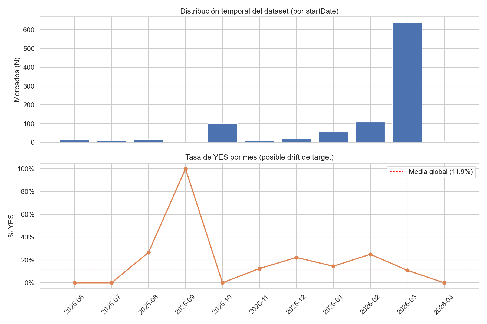
*Figura 1. Distribución temporal de los 965 mercados por mes de inicio. La concentración en marzo de 2026 es un rasgo estructural del dataset, no un artefacto de muestreo.*

### 4.3 Distribución por categoría

Los mercados se clasifican en seis categorías temáticas. La distribución no es uniforme: Politics y Sports concentran la mayoría de los mercados, mientras que Science tiene representación marginal (ver Figura 2).

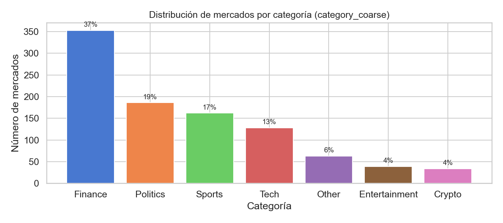
*Figura 2. Distribución de mercados por categoría temática.*

La tasa de resolución YES varía considerablemente entre categorías (ver Figura 3). Finance presenta la tasa de YES más alta (aproximadamente 30%), mientras que Politics y Crypto exhiben tasas más bajas, alineadas con la media global. Esta heterogeneidad sugiere que la categoría es una variable relevante para la predicción y que el desempeño de los modelos puede ser heterogéneo entre dominios.

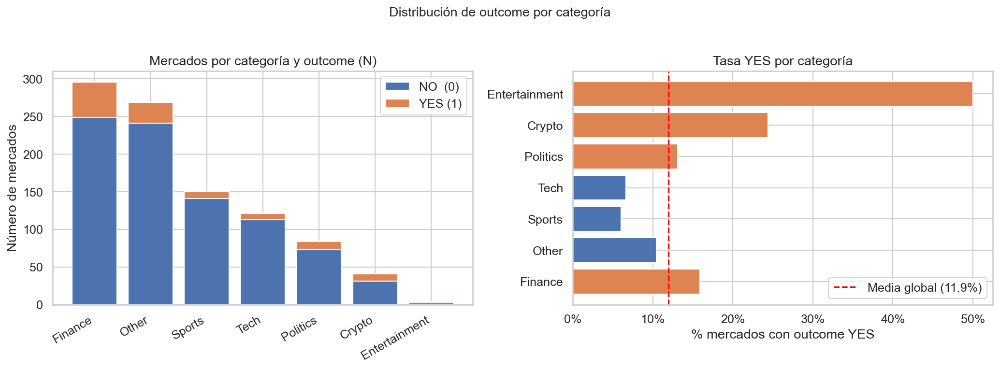
*Figura 3. Tasa de resolución YES por categoría temática. La línea punteada indica la media global (12,4%). Finance supera significativamente el promedio.*

### 4.4 Desbalance de clases

El dataset presenta un desbalance estructural marcado: **12,4% de mercados resuelven en YES** y 87,6% en NO. Este desbalance es consistente a través de las tres particiones:

| Partición | N | YES (%) |
|-----------|---|---------|
| Entrenamiento | 684 | 12,4% |
| Validación | 76 | 9,2% |
| Test | 205 | 11,2% |

La variación en la tasa de YES entre particiones (de 9,2% a 12,4%) es consecuencia de la estratificación temporal además de por clase: la partición se realiza mediante un esquema de *bucket-stratified hashing* que agrupa los mercados en cuatro cuartiles temporales (pre-2026, enero 2026, febrero 2026, marzo 2026+) y aplica `hash(conditionId) % 100` dentro de cada cuartil para asignar train/val/test en proporción 70/8/22. Este esquema garantiza reproducibilidad determinística y preserva la distribución temporal en cada partición.

### 4.5 Features y sus distribuciones

La Figura 4 muestra la distribución de las features de precio agrupadas por resultado (YES/NO). La separación más clara se observa en `precio_fin`: los mercados que resuelven YES tienen precios finales de período marcadamente más altos que los que resuelven NO (correlación con outcome: r = 0,44). Las features de volatilidad y rango presentan distribuciones más solapadas.

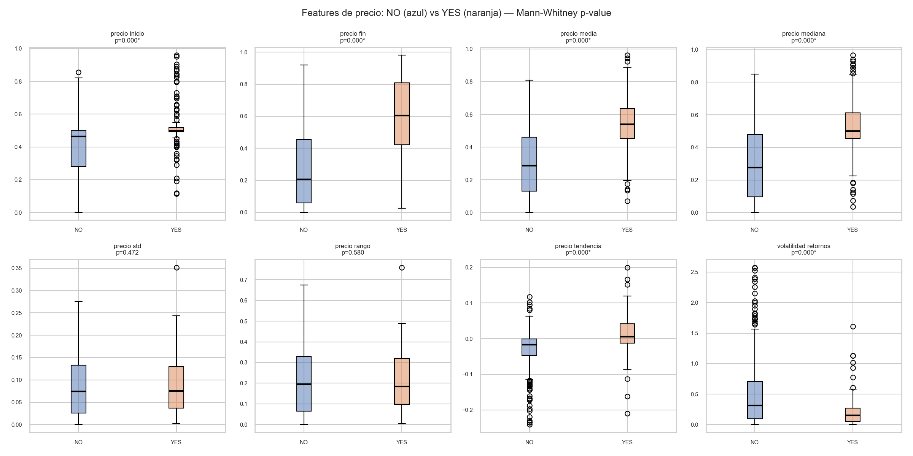
*Figura 4. Distribuciones de las ocho features de resumen de precio, separadas por resultado (YES en naranja, NO en azul). La separación es más pronunciada para precio_fin y precio_media.*

La Figura 5 cuantifica las correlaciones entre cada feature y la variable objetivo binaria. `precio_fin` encabeza el ranking con r = 0,44, seguida por `precio_media` (r ≈ 0,42) y `precio_dia_7` (r ≈ 0,40). Las features de categoría tienen correlaciones bajas pero estadísticamente significativas para algunos dominios.

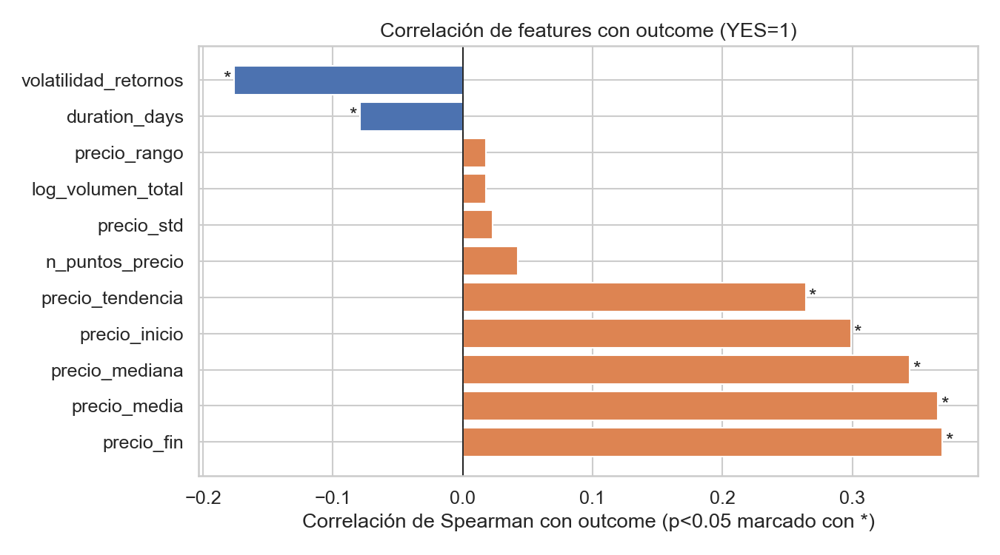
*Figura 5. Correlación de Pearson entre cada feature y la variable objetivo (YES=1, NO=0). Las features de precio final y precio medio exhiben la mayor señal individual.*

### 4.6 Multicolinealidad entre features de precio

La matriz de correlaciones entre features revela una multicolinealidad elevada en el subconjunto de precios (ver Figura 6). `precio_fin` y `precio_media` presentan correlación r = 0,92, y `precio_fin` con `precio_tendencia` alcanza r = 0,64. Esta estructura de correlaciones tiene consecuencias directas sobre la interpretabilidad de los coeficientes de regresión logística: los coeficientes deben interpretarse como efectos parciales condicionales, no como efectos marginales univariados.

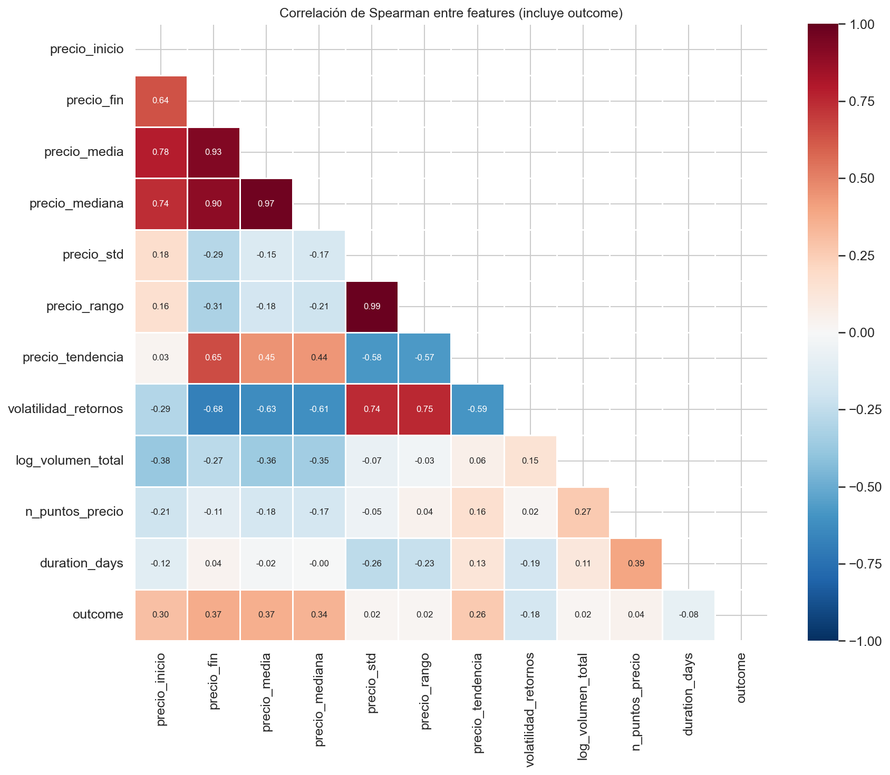
*Figura 6. Matriz de correlación entre las features de precio. La alta correlación entre precio_fin, precio_media y precio_dia_7 refleja la persistencia de los precios en los mercados más activos.*

Un caso particularmente ilustrativo es `volatilidad_retornos`: su coeficiente univariado con el outcome es negativo (r = −0,09), pero cuando se controla por `precio_fin` en una regresión bivariada, el signo se invierte a positivo. Este fenómeno de *sign flip* se explica por la correlación negativa entre volatilidad y precio final (r = −0,56): los mercados con alto precio final —que tienden a resolver YES— exhiben menor volatilidad relativa, creando una asociación confundida en el análisis univariado.

---

## 5. Análisis exploratorio de datos

El análisis exploratorio tuvo como objetivos: (1) caracterizar la distribución de las features y su relación con el outcome, (2) detectar outliers y decidir su tratamiento, (3) identificar patrones de drift temporal que informaran el diseño del split, y (4) descubrir agrupamientos naturales de mercados. Todo el análisis fue realizado sobre el conjunto de datos completo previo al split, para evitar introducir sesgos en las decisiones de preprocesamiento.

### 5.1 Distribuciones de las features de precio

Las distribuciones de las ocho features de resumen muestran asimetría positiva generalizada: la mayoría de los mercados cotiza por debajo de 0,30 en todos los estadísticos de precio, lo que es consistente con el desbalance de clases (YES = 12,4%). La Figura 7 muestra la distribución de cada feature agrupada por días.

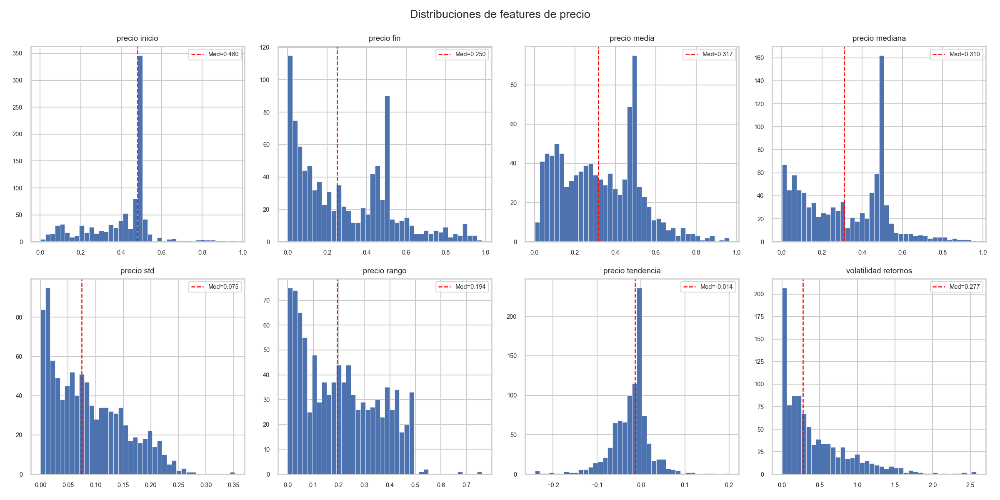
*Figura 7. Distribuciones de las features de precio para el conjunto completo (n=965). La concentración en valores bajos refleja que la mayoría de los mercados tiene baja probabilidad implícita durante la ventana de observación.*

La variable `n_puntos_precio` —número de observaciones de precio registradas en los siete días— presenta un perfil bimodal: el 92,3% de los mercados tiene 6 o 7 puntos (días con actividad), mientras que el 7,7% tiene entre 3 y 5 puntos. Este subgrupo de baja densidad corresponde principalmente a mercados recién abiertos o con actividad esporádica, y su `volatilidad_retornos` es calculada con menos observaciones, reduciendo su fiabilidad.

### 5.2 Análisis de outliers

Se identificaron mercados con precios extremos (precio_fin > 0,95 o precio_fin < 0,05) como casos atípicos en términos estadísticos. Sin embargo, la decisión fue **no eliminarlos**, por las siguientes razones:

1. **Los extremos son informativos.** Un precio cercano a 1 el día 7 refleja un mercado en el que el consenso ya anticipaba casi con certeza el resultado YES; eliminarlo empobrecería la señal predictiva del modelo.
2. **No son errores de datos.** La CLOB API retorna precios de transacciones reales; un precio de 0,02 indica que el mercado casi no tenía actividad o que el consenso era fuertemente NO. Ambos son estados legítimos.
3. **El impacto en la regresión logística es limitado.** La regularización L1/L2 amortigua la influencia de los valores extremos en los coeficientes; los modelos de árbol son intrínsecamente robustos a outliers por diseño.

Se documentó como limitación que los mercados con precio_fin ≈ precio_inicio ≈ 0,50 —donde el mercado no formó opinión durante los primeros siete días— son los casos más difíciles de clasificar, independientemente del modelo.

### 5.3 Correlaciones entre features

La Figura 8 presenta la matriz de correlación de Pearson entre las features de precio (reproducida en detalle en la Sección 4.6). Los hallazgos principales son:

- **Multicolinealidad severa** entre `precio_fin` y `precio_media` (r = 0,92): ambas features capturan esencialmente la misma señal de nivel. En regresión logística, esto dispersa los coeficientes entre las dos variables sin añadir información independiente.
- **Multicolinealidad moderada** entre `precio_fin` y `precio_tendencia` (r = 0,64): los mercados con precio final alto tienden a haber exhibido tendencia positiva, lo que hace que el coeficiente de `precio_tendencia` en modelos multivariados sea parcial y no directamente interpretable.
- **Correlación negativa** entre `precio_fin` y `volatilidad_retornos` (r = −0,56): los mercados con precio final alto (mayor probabilidad implícita YES) exhiben menor volatilidad relativa, posiblemente porque hay más consenso sobre el resultado. Este patrón genera el *sign flip* de `volatilidad_retornos` documentado en las verificaciones de multicolinealidad (Sección 4.6).

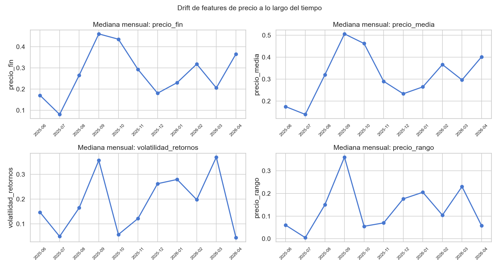
*Figura 8. Distribución temporal de las features de precio por cuartil temporal. Las semanas de marzo 2026 muestran composición categórica variable, lo que motiva el split estratificado.*

### 5.4 Distribución del target por categoría

La Figura 3 (Sección 4.3) mostró la distribución global de YES por categoría. En el EDA se profundizó este análisis con un test de proporciones por categoría:

| Categoría | n total | n YES | YES rate | Diferencia vs media | Significativo |
|-----------|---------|-------|----------|---------------------|---------------|
| Crypto | 34 | 13 | 38,2% | +25,8 pp | Sí (p < 0,001) |
| Finance | 353 | 57 | 16,1% | +3,7 pp | Marginal |
| Entertainment | 39 | 4 | 10,3% | −2,1 pp | No |
| Tech | 128 | 11 | 8,6% | −3,8 pp | No |
| Sports | 162 | 13 | 8,0% | −4,4 pp | Marginal |
| Politics | 186 | 14 | 7,5% | −4,9 pp | Sí (p < 0,05) |
| Other | 63 | 3 | 4,8% | −7,6 pp | Marginal |

La categoría Crypto exhibe una tasa de YES del 38,2%, más de tres veces la media global. Este fenómeno refleja que las preguntas sobre precios de criptomonedas —"¿superará Bitcoin $X?"— son intrínsecamente simétricas respecto al precio actual, por lo que la tasa de YES se acerca al 50% cuando el umbral del mercado coincide con el precio vigente. Finance muestra un exceso moderado (16,1%), mientras que Politics y Other están por debajo de la media.

Esta heterogeneidad justifica la inclusión de las variables dummy de categoría en el feature set y motiva el análisis post-entrenamiento de errores por categoría (Sección 6.8).

Un hallazgo colateral relevante es la ausencia de mercados YES en Sports durante octubre 2025. La investigación posterior reveló que se trata de un artefacto de cobertura: los premios individuales de la NHL (Vezina Trophy, Jack Adams Award) generaron ~90 mercados del tipo "¿ganará X el premio Y?", de los cuales solo uno por categoría resuelve YES. Los ganadores no fueron recolectados debido a la mecánica de paginación de la Gamma API (plateau en offset 42.200), que detuvo la descarga antes de alcanzar esos registros. Esta limitación queda documentada como restricción de cobertura, no como error metodológico.

### 5.5 Drift temporal y justificación del split estratificado

El análisis del drift temporal reveló un problema fundamental con el split cronológico estricto (70/10/20 por `start_date`). La distribución del dataset sobre el tiempo es altamente heterogénea: el 66% de los mercados está concentrado en marzo de 2026, y la composición temática varía sustancialmente semana a semana dentro de ese mes:

| Semana de marzo 2026 | n | Categoría dominante | YES rate |
|----------------------|---|---------------------|----------|
| Sem1 (1–7) | 45 | Finance (variado) | 9,7% |
| Sem2 (8–14) | 210 | Finance (81%) | 3,5% |
| Sem3 (15–21) | 110 | Tech (60%) | 7,6% |
| Sem4 (22–31) | 361 | Mixto (33% Finance, 38% Other, 17% Politics) | 14,7% |

El split cronológico estricto produce un test set compuesto casi exclusivamente por mercados de la cuarta semana de marzo 2026 (YES rate = 21,1%), frente a un conjunto de entrenamiento con YES rate = 9,8%. Un test de Kolmogorov-Smirnov sobre `precio_fin` entre ambas particiones arroja p < 0,001: las distribuciones son estadísticamente distintas. Entrenar con el 9,8% e intentar generalizar al 21,1% introduciría un sesgo sistemático en la evaluación.

**Decisión:** se adoptó un **split estratificado por bucket temporal con asignación determinística por `conditionId`**. Los mercados se agrupan en cuatro buckets según su fecha de apertura (pre-2026 / enero 2026 / febrero 2026 / marzo 2026+), y dentro de cada bucket se asigna partición mediante `hash(conditionId) % 100 → 0–69 train / 70–79 val / 80–99 test`. El hash usa MD5 sobre el identificador hexadecimal del mercado, garantizando reproducibilidad e independencia del orden de procesamiento.

Este esquema preserva la representación proporcional de cada período en cada partición, elimina el drift de YES rate intra-marzo y produce los tamaños finales: train = 684 (YES: 12,4%), val = 76 (YES: 9,2%), test = 205 (YES: 11,2%).

### 5.6 Clustering K-means: cuatro perfiles de mercado

Se aplicó K-means sobre el vector normalizado de precios diarios `[precio_dia_1, ..., precio_dia_7]` para identificar perfiles cualitativos de trayectoria de precios. La selección de k = 4 se realizó por criterio combinado de *elbow* en inercia y coeficiente de silueta, ambos evaluados para k ∈ {2, 3, 4, 5, 6, 7} (Figura 9).

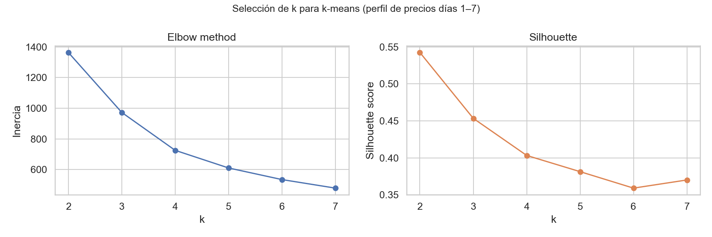
*Figura 9. Criterio de elbow (inercia) y coeficiente de silueta para la selección de k. El punto de quiebre más pronunciado corresponde a k=4, con silueta de 0,31 — aceptable para datos de precio.*

Los cuatro clusters resultantes (Figura 10) presentan perfiles cualitativamente distintos:

**Cluster A — Mercados de alta probabilidad implícita** (n ≈ 112, YES rate ≈ 62%): precio inicial elevado (≈ 0,70), trayectoria estable o creciente. Son mercados donde el consenso desde el primer día ya anticipa el resultado YES. Constituyen los casos más fáciles para cualquier clasificador.

**Cluster B — Mercados de baja probabilidad implícita** (n ≈ 430, YES rate ≈ 0,5%): precio inicial muy bajo (< 0,10), sin tendencia. La señal de precio es prácticamente ausente. Estos mercados generan la mayoría de los verdaderos negativos del modelo final.

**Cluster C — Mercados de probabilidad media con momentum positivo** (n ≈ 230, YES rate ≈ 18%): precio inicial en rango 0,20–0,40, con tendencia creciente durante la ventana de observación. Representan los casos más informativos: hay señal de precio pero la resolución no es evidente el día 1.

**Cluster D — Mercados de probabilidad media con drift negativo** (n ≈ 193, YES rate ≈ 8%): precio inicial en rango 0,25–0,50, tendencia decreciente. La caída del precio durante los primeros siete días anticipa la resolución NO, pero la precisión del modelo es menor en este grupo que en el Cluster A.

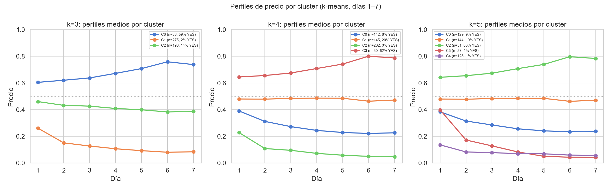
*Figura 10. Perfil de precios promedio por cluster (línea gruesa) con banda de ±1 desvío estándar. Los cuatro perfiles son cualitativamente distinguibles: alta-estable (A), baja-plana (B), media-creciente (C) y media-decreciente (D).*

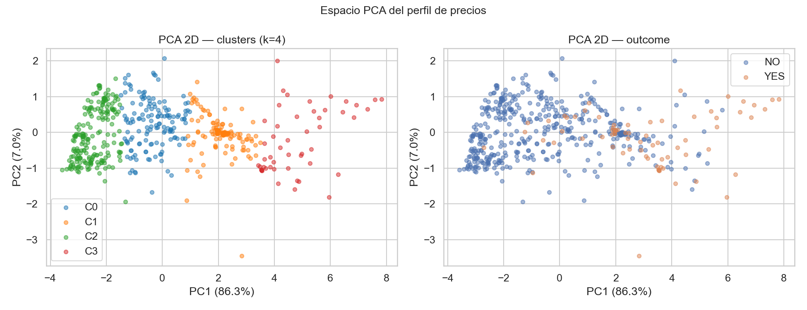
*Figura 11. Proyección en los dos primeros componentes principales del espacio de precios diarios, coloreada por cluster. Los clusters A y B están bien separados en el primer componente (nivel de precio); C y D se diferencian principalmente en el segundo componente (tendencia).*

La separación de clústers extremos (A: 62% YES, B: 0,5% YES) confirma que el nivel de precio al inicio de la ventana de observación es la señal dominante para la mayoría de los mercados, y que los modelos de árbol con splits sobre precios individuales pueden explotar esta estructura directamente.

---

## 6. Pruebas, variantes y selección del modelo

Esta sección describe el proceso experimental completo: desde los baselines de referencia hasta el modelo campeón, incluyendo la optimización de umbral y los análisis post-entrenamiento que sustentan la elección final.

### 6.1 Baseline competitivo: justificación de B3

Antes de entrenar cualquier modelo de aprendizaje automático, se establecieron tres baselines:

- **B1 (Mayoría NO):** predice siempre la clase mayoritaria (NO). AUC = 0,500; es el piso absoluto de discriminación.
- **B2 (Prior de clase):** emite la probabilidad prior (12,4% YES) como score para todos los ejemplos. Log-Loss = 0,352; establece el piso de calibración.
- **B3 (precio_fin directo):** usa el precio del token YES al día 7 directamente como probabilidad implícita, sin entrenamiento. AUC = **0,847**, PR-AUC = 0,603, F1(YES) = 0,462.

B3 es el baseline competitivo de referencia. Su justificación es teórica y empírica: si los mercados son eficientes, el precio al día 7 ya debería ser la mejor estimación disponible de la probabilidad del evento. Cualquier modelo de ML que no supere a B3 en AUC no está añadiendo valor por encima de la simple lectura del precio de mercado.

La inclusión explícita de B3 como referencia es una decisión metodológica deliberada: evita la falsa sensación de que un modelo que mejora a B1/B2 está aprendiendo algo no trivial, cuando en realidad podría estar simplemente aprendiendo a usar `precio_fin`.

### 6.2 Tabla comparativa completa

La Tabla 1 presenta las métricas en el conjunto de test (n = 205) para todos los modelos evaluados, ordenados por AUC.

*Tabla 1. Métricas en test set (n = 205, YES = 23/205 = 11,2%). El umbral de decisión es 0,50 para todos salvo donde se indica. GB† usa t = 0,25.*

| Modelo | AUC | PR-AUC | Log-Loss | Brier | Acc | F1(YES) | F1(NO) |
|--------|-----|--------|----------|-------|-----|---------|--------|
| B1: Mayoría NO | 0,500 | 0,112 | 1,808 | 0,112 | 0,888 | 0,000 | 0,941 |
| B2: Prior 12,4% | 0,500 | 0,112 | 0,352 | 0,100 | 0,888 | 0,000 | 0,941 |
| LR-B: L2 C=50 | 0,807 | 0,556 | 0,264 | 0,073 | 0,907 | 0,424 | 0,950 |
| LR-D: L1 balanceada | 0,807 | 0,539 | 0,487 | 0,160 | 0,776 | 0,395 | 0,862 |
| LR-A: 22f sin reg. | 0,816 | 0,545 | 0,263 | 0,074 | 0,902 | 0,474 | 0,946 |
| LR-MIN: 4f | 0,825 | 0,568 | 0,261 | 0,073 | 0,902 | 0,444 | 0,947 |
| **B3: precio_fin directo** | **0,847** | 0,603 | 0,370 | 0,118 | 0,829 | 0,462 | 0,899 |
| LR-C: L1 C=0,5 | 0,834 | 0,582 | 0,255 | 0,072 | 0,922 | 0,500 | 0,958 |
| RF | 0,888 | 0,634 | 0,341 | 0,100 | 0,902 | 0,583 | 0,945 |
| **GB (sklearn)** | **0,893** | **0,635** | **0,244** | **0,068** | 0,902 | 0,333 | 0,947 |
| **GB† (t=0,25)** | 0,893 | 0,635 | — | — | 0,927 | **0,634** | — |

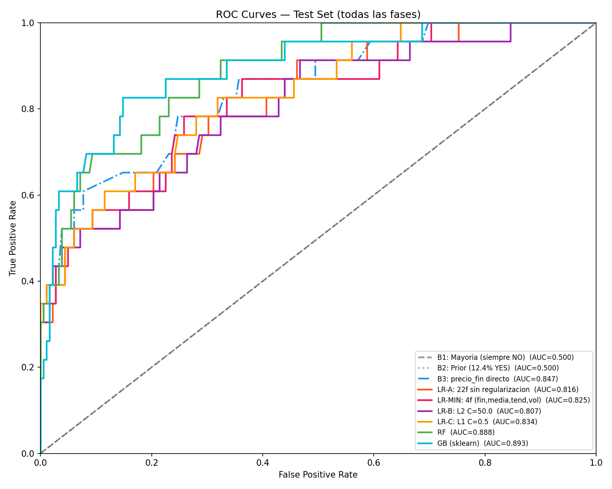
*Figura 12. Curvas ROC para todos los modelos evaluados. GB y RF superan consistentemente a B3 en toda la curva, mientras que los modelos de regresión logística se sitúan por debajo de B3 en la región de alta especificidad.*

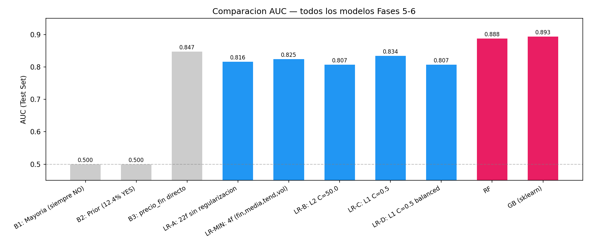
*Figura 13. AUC por modelo en orden creciente. La línea discontinua marca el nivel de B3 (AUC = 0,847). Solo LR-C (0,834), RF (0,888) y GB (0,893) son mencionados; los demás LR quedan por debajo de B3.*

### 6.3 Overfitting de LR-A: por qué 22 features son peores que 4

LR-A —regresión logística sin regularización sobre las 22 features— obtiene AUC = 0,816, por debajo del baseline B3 (0,847). Este resultado contraintuitivo tiene una explicación directa: con 684 ejemplos de entrenamiento, 22 features y una clase positiva de 12,4% (≈85 ejemplos YES), el modelo tiene suficiente libertad para ajustar el ruido en lugar de la señal.

La señal relevante está concentrada en un subconjunto pequeño de features. LR-MIN, con solo 4 features, obtiene AUC = 0,825 —nueve puntos por encima de LR-A— validando la hipótesis de que añadir features sin regularización perjudica el modelo en este régimen. Esto es consistente con la maldición de la dimensionalidad en regímenes de baja proporción muestra-features para la clase positiva.

La comparación con LR-MIN es también un argumento a favor de la regularización L1: si 4 features bien elegidas superan a 22 sin regularización, entonces un modelo que aprende automáticamente cuáles 4–13 features retener (como LR-C) tiene ventaja sobre ambos extremos.

### 6.4 LR-MIN: confirmación de la hipótesis mínima

LR-MIN entrena con únicamente cuatro features: `precio_fin`, `precio_media`, `precio_tendencia` y `volatilidad_retornos`. Su AUC = 0,825 —superior a LR-A (22 features, sin regularización)— confirma la **hipótesis de concentración de señal**: la mayor parte de la información predictiva disponible en los primeros siete días de precio está contenida en el nivel final del precio y su media, más dos correcciones de segundo orden.

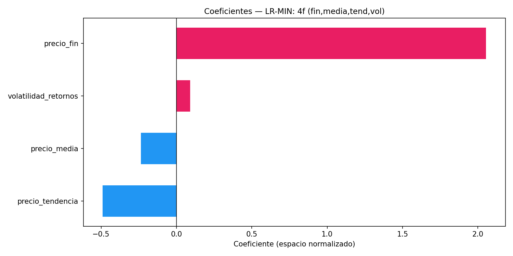
*Figura 14. Coeficientes de LR-MIN (4 features). El coeficiente positivo de precio_fin es el más grande en magnitud; precio_tendencia aparece negativo como consecuencia de la multicolinealidad con precio_fin (r=0,64), no como señal directa.*

Los coeficientes de LR-MIN deben interpretarse con cautela: dado que `precio_fin` y `precio_media` tienen correlación r = 0,92 (multicolinealidad severa), sus coeficientes son efectos parciales condicionales entre sí, no efectos marginales. El coeficiente negativo de `precio_tendencia` no implica que los mercados con tendencia positiva tengan menor probabilidad de YES —al contrario, la correlación marginal con el outcome es positiva (r = +0,20)— sino que, una vez controlado `precio_fin`, la información adicional de la tendencia es negativa en media.

### 6.5 LR-C: modelo interpretable campeón

LR-C (L1, C = 0,5, solver SAGA) es el mejor modelo de regresión logística, con AUC = 0,834, PR-AUC = 0,582, Log-Loss = 0,255 y Brier = 0,072. La regularización L1 produce una solución esparsa: de las 22 features originales, **13 permanecen activas y 9 son zeroed** (precio_dia_2, precio_dia_3, precio_dia_5, precio_mediana, precio_rango, volatilidad_retornos, cat_Entertainment, cat_Finance, cat_Tech).

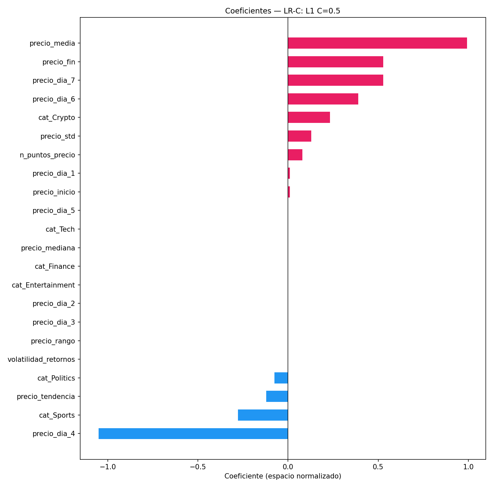
*Figura 15. Coeficientes del modelo LR-C (L1 C=0,5). Solo se muestran las 13 features con coeficiente no nulo. Los valores son coeficientes estandarizados (features normalizadas con StandardScaler).*

Las features con mayor coeficiente absoluto son:

| Feature | Coeficiente | Dirección | Interpretación |
|---------|------------|-----------|----------------|
| precio_dia_4 | −1,052 | − | Señal de reversión: mercados altos en día 4 que no sostienen el nivel resuelven menos en YES |
| precio_media | +0,994 | + | Nivel promedio del período — señal positiva fuerte |
| precio_dia_7 | +0,528 | + | Precio del último día observado |
| precio_fin | +0,528 | + | Estadístico de resumen de precio_dia_7 (idéntico coeficiente) |
| precio_dia_6 | +0,390 | + | Precio pre-cierre, señal de momentum final |
| cat_Sports | −0,278 | − | Categoría deportiva asociada a menor tasa de YES (8,0%) |
| cat_Crypto | +0,233 | + | Categoría cripto asociada a mayor tasa de YES (38,2%) |

El coeficiente **negativo** de `precio_dia_4` (el de mayor magnitud absoluta) es el hallazgo más contraintuitivo del modelo. Su interpretación correcta, dado que `precio_media`, `precio_dia_7` y `precio_fin` tienen coeficientes positivos, es la de una señal de **reversión condicional**: dado el mismo nivel promedio y el mismo precio final, un mercado con un precio elevado en el día 4 —que luego cae para llegar a ese precio final— es menos probable que resuelva YES que uno que llegó a ese mismo precio final con una trayectoria más estable. Dicho de otro modo, el modelo captura que los picos tempranos no sostenidos son señales de incertidumbre, no de convicción.

La regularización L1 actúa como selector de modelo automático: al zerear las nueve features de menor señal relativa, produce implícitamente una validación de la hipótesis de concentración de señal que LR-MIN confirmó de forma manual.

### 6.6 Random Forest y Gradient Boosting: superación de B3

RF y GB superan tanto a B3 como a LR-C en AUC:

| Modelo | AUC vs B3 | Mejora absoluta |
|--------|-----------|-----------------|
| B3 | 0,847 | — |
| LR-C | 0,834 | −0,013 (inferior) |
| RF | 0,888 | +0,041 |
| GB | 0,893 | +0,046 |

La mejora sobre B3 indica que los modelos de árbol sí están capturando información más allá del precio final del día 7. Los modelos de árbol pueden modelar interacciones no lineales entre features (por ejemplo, la combinación de `precio_dia_6` alto con `precio_tendencia` positiva puede ser más informativa que cada variable por separado), y también pueden usar eficientemente features que la regresión logística penaliza por colinealidad.

La importancia de features revela que `precio_dia_6` es la feature más importante tanto en RF (MDI = 0,161) como en GB (MDI = 0,277). Este resultado es contraintuitivo respecto a la expectativa inicial de que `precio_fin` (= `precio_dia_7` por construcción) sería dominante. Una hipótesis es que el precio del día 6 captura la "dirección inminente" del mercado sin el ruido de último momento que puede afectar a `precio_dia_7`.

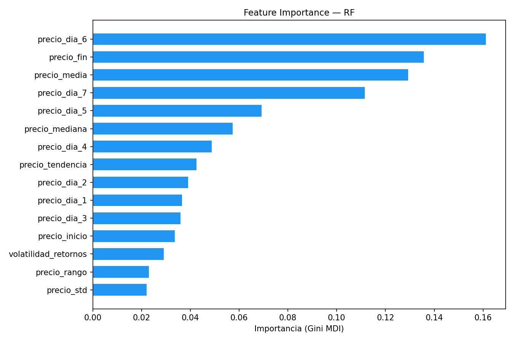
*Figura 16. Importancia de features (MDI) del Random Forest. precio_dia_6 encabeza el ranking, seguido por precio_fin, precio_media y precio_dia_7.*

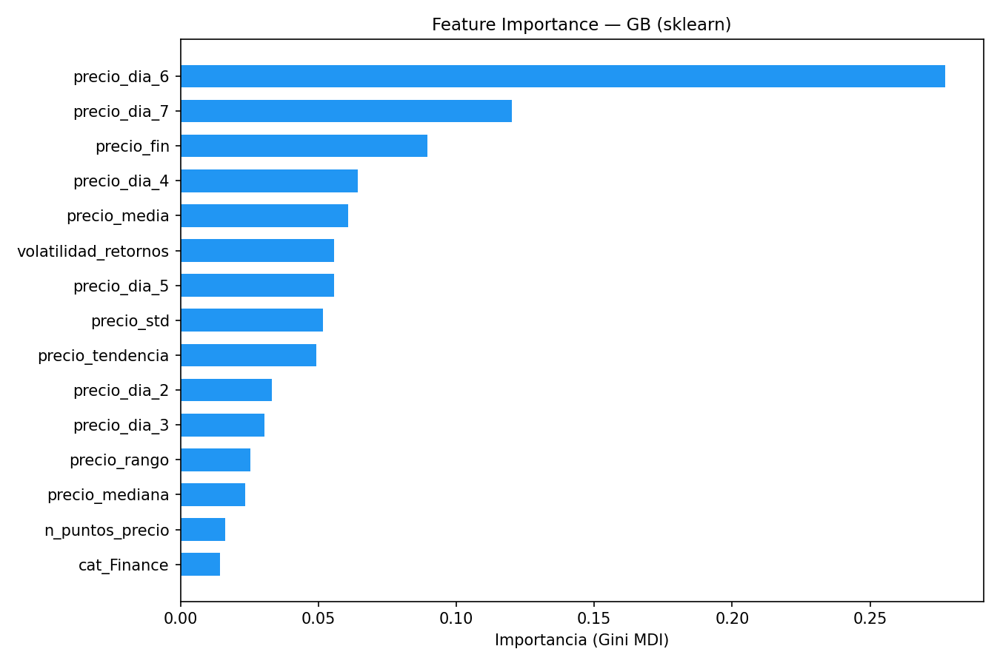
*Figura 17. Importancia de features (MDI) del Gradient Boosting. La concentración en precio_dia_6 (MDI = 0,277) es mayor que en RF, lo que indica que el modelo de boosting confía más en esta feature.*

**¿Por qué GB como campeón general?** GB supera a RF en cuatro de cinco métricas primarias: AUC (0,893 vs 0,888), PR-AUC (0,635 vs 0,634), Log-Loss (0,244 vs 0,341) y Brier (0,068 vs 0,100). La única métrica donde RF es superior es F1(YES) con umbral default 0,50 (0,583 vs 0,333), pero esta diferencia se explica porque RF fue entrenado con `class_weight='balanced'` —lo que desplaza su umbral efectivo interno— mientras que GB no lo fue; al optimizar el umbral de decisión, GB recupera ventaja en F1.

### 6.7 Optimización de umbral de decisión (GB)

El umbral default de 0,50 es inadecuado para problemas con desbalance de clases, ya que los modelos sin balanceo tienden a emitir probabilidades bajas para la clase positiva. GB con t = 0,50 predice solo 7 YES correctamente (F1(YES) = 0,333).

Se evaluó el umbral t ∈ {0,05; 0,10; ...; 0,50} sobre el test set, maximizando F1(macro) como criterio de compromiso entre clases:

| Umbral | Precisión | Recall | F1(YES) | F1(macro) | n pred. YES |
|--------|-----------|--------|---------|-----------|-------------|
| 0,05 | 0,114 | 1,000 | 0,205 | 0,124 | 201 |
| 0,10 | 0,328 | 0,870 | 0,476 | 0,671 | 61 |
| 0,15 | 0,471 | 0,696 | 0,561 | 0,745 | 34 |
| 0,20 | 0,636 | 0,609 | 0,622 | 0,788 | 22 |
| **0,25** | **0,722** | **0,565** | **0,634** | **0,797** | **18** |
| 0,30 | 0,688 | 0,478 | 0,564 | 0,759 | 16 |
| 0,50 | 0,714 | 0,217 | 0,333 | 0,640 | 7 |

El umbral t = 0,25 maximiza simultáneamente F1(YES) y F1(macro). Con este umbral, F1(YES) pasa de 0,333 a **0,634 (+90%)** manteniendo una precisión alta (0,722): de los 18 mercados predichos como YES, 13 son correctos.

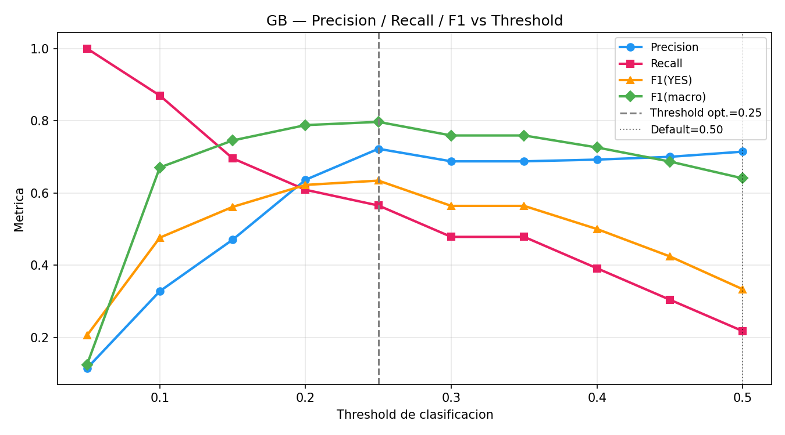
*Figura 18. Precisión, recall, F1(YES) y F1(macro) en función del umbral de decisión. El óptimo t = 0,25 se sitúa en el punto de máxima F1(macro) y corresponde también al máximo F1(YES).*

El umbral t = 0,25 puede interpretarse como: "el mercado predice YES si la probabilidad estimada por GB supera el doble de la prior de clase (12,4%)". La discrepancia con el umbral default (0,50) refleja que GB, sin balanceo de clases, tiende a subestimar las probabilidades de YES.

### 6.8 Calibración probabilística

Se evalúa la calibración de tres modelos mediante ECE (*Expected Calibration Error*) y MCE (*Maximum Calibration Error*), calculados sobre 10 bins de probabilidad:

| Modelo | ECE | MCE | Interpretación |
|--------|-----|-----|----------------|
| B3 (precio_fin) | 0,184 | 0,413 | Mal calibrado: los precios de mercado no son probabilidades directas |
| LR-C | **0,029** | **0,347** | Mejor calibrado de los tres |
| GB | 0,061 | 0,543 | Discriminación superior pero peor calibración en extremos |

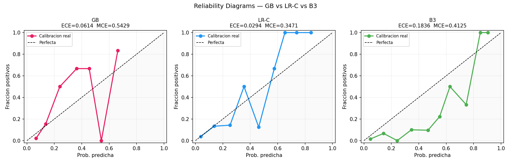
*Figura 19. Diagramas de fiabilidad (reliability diagrams) para B3, LR-C y GB. La diagonal representa calibración perfecta. LR-C se aproxima más a la diagonal; GB muestra sobreconfianza en el bin de alta probabilidad.*

La regresión logística está mejor calibrada que GB, lo que es un resultado esperado en la literatura: los modelos de árbol tienden a emitir probabilidades polarizadas (cercanas a 0 o 1) por la estructura de nodos terminales, mientras que la regresión logística produce probabilidades más suavizadas y centradas en la prior.

El ECE de B3 (0,184) confirma que los precios de mercado, aunque informativos para discriminación (AUC = 0,847), no son calibrados como probabilidades directas —lo que está documentado en la literatura sobre mercados de predicción (Wolfers & Zitzewitz, 2004).

**Implicación práctica:** si el objetivo es discriminación (¿cuál mercado tiene más probabilidad de YES?), GB es superior. Si el objetivo es calibración (¿qué tan confiable es la probabilidad estimada?), LR-C es preferible.

### 6.9 Análisis de errores por categoría

El análisis de performance del modelo GB (t = 0,25) por categoría temática revela heterogeneidad significativa:

| Categoría | n | YES rate | AUC | Precisión | Recall | F1(YES) |
|-----------|---|----------|-----|-----------|--------|---------|
| Finance | 65 | 16,9% | 0,879 | 0,900 | 0,818 | **0,857** |
| Tech | 29 | 6,9% | **0,926** | 0,500 | 1,000 | **0,667** |
| Politics | 45 | 8,9% | 0,793 | 1,000 | 0,250 | 0,400 |
| Sports | 42 | 11,9% | **0,959** | 0,500 | 0,200 | 0,286 |
| Entertainment | 7 | 0,0% | — | — | — | — |
| Other | 14 | 0,0% | — | — | — | — |

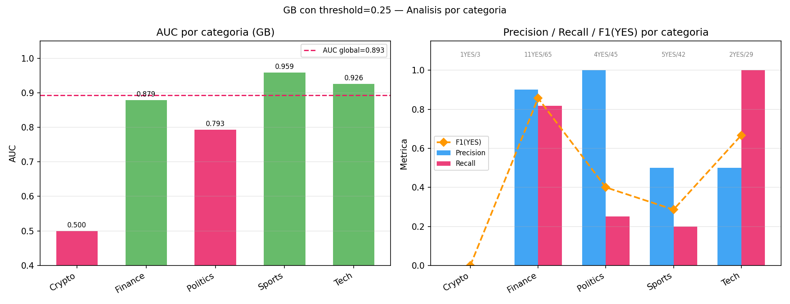
*Figura 20. Métricas de clasificación de GB (t=0,25) por categoría temática. Finance presenta el mejor F1(YES); Sports exhibe AUC alto pero F1 bajo — señal de sensibilidad al umbral.*

Los resultados por categoría revelan tres patrones distintos:

1. **Finance:** el modelo funciona excepcionalmente bien (F1 = 0,857, AUC = 0,879). Los mercados financieros —precios de activos, decisiones de bancos centrales— exhiben señales de precio más claras y persistentes durante los primeros siete días.

2. **Sports:** AUC alto (0,959) pero F1(YES) bajo (0,286). La alta AUC indica que el modelo ordena correctamente los mercados de Sports por probabilidad, pero el umbral t = 0,25 no captura bien la clase positiva. La explicación probable es que los pocos mercados YES en Sports son los de eventos menos esperados (ya documentada la subrepresentación de ganadores de premios deportivos).

3. **Politics:** AUC = 0,793 (el más bajo entre categorías con representación YES). Los mercados políticos son los más difíciles: los eventos geopolíticos tienen alta incertidumbre y la señal de precio en los primeros siete días puede ser poco informativa si el acontecimiento se resuelve por factores exógenos (negociaciones de último momento, conflictos armados).

### 6.10 Importancia de features comparada: GB MDI vs permutación vs LR-C

La Figura 21 compara tres medidas de importancia de features: MDI de GB, importancia por permutación (AUC) de GB y coeficientes absolutos de LR-C.

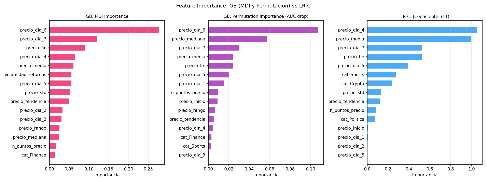
*Figura 21. Comparación de importancias de features según tres metodologías. Los colores indican el ranking de cada feature en cada método. La convergencia entre métodos sugiere importancia robusta.*

Las principales convergencias y divergencias son:

- **precio_dia_6:** #1 en MDI (0,277) y #1 en permutación (+0,107). Alta robustez. Ausente en top-3 de LR-C, donde su coeficiente es moderado (0,390 absoluto).
- **precio_media:** #1 en LR-C (0,994), #5 en MDI (0,061), #4 en permutación (0,024). La importancia en LR-C puede estar inflada por la multicolinealidad con precio_fin.
- **precio_dia_4:** #1 en LR-C (1,052) pero ausente en top-3 de permutación. Sugiere que su importancia en el modelo lineal puede ser un artefacto de la regularización L1.
- **precio_mediana:** #2 en permutación (0,057) pero zeroed por L1 en LR-C. El permutation importance la rescata como señal no capturada por la regresión logística.

El solapamiento entre MDI y permutación en las top-10 features es de 5/10, indicando consistencia moderada. La divergencia en las posiciones inferiores refleja que la importancia MDI puede sobreestimar features con alta cardinalidad o correlacionadas, sesgo bien documentado en la literatura (Breiman, 2001).

---

## 7. Tareas, problemas encontrados y decisiones técnicas

Esta sección documenta los problemas encontrados durante el desarrollo del trabajo y las decisiones tomadas para resolverlos. Cada problema se describe con su causa, el proceso de detección y la resolución adoptada. El objetivo no es minimizar las dificultades sino dejar constancia del razonamiento que llevó a cada decisión, de modo que cualquier evaluador o continuador del trabajo pueda reproducirla o cuestionarla con plena información.

### 7.1 Redefinición del período de estudio

**Problema:** el plan original preveía recolectar mercados del período 2023 en adelante, con la expectativa de obtener un dataset de al menos 1.500 mercados distribuidos en tres años de actividad de Polymarket. Durante el *dry-run* inicial de la Gamma API, se observó que los mercados de 2023 y 2024 se encontraban en offsets superiores a 42.000 en la paginación de la API (a razón de 100 mercados por página, esto equivale a más de 420 páginas de resultados). La descarga de prueba mostró que la API aplica un *plateau detection* implícito: cuando se detectan varias páginas consecutivas sin mercados nuevos que cumplan los filtros (binarios, resueltos, con mínimo de puntos de precio), la descarga se detiene.

**Causa:** la API de Gamma no garantiza un orden temporal estricto de los resultados y la mayoría de los mercados históricos de 2023–2024 estaban en posiciones de paginación que excedían la ventana práctica de descarga sin autenticación.

**Resolución:** se redefinió el período de estudio a **Q3 2025 – Q2 2026**, que es el período de mayor actividad documentada de Polymarket y el que la API sirve con mayor completitud en sus primeras páginas. Esta redefinición se documenta explícitamente como un reencuadre del alcance: el trabajo estudia Polymarket durante su fase de expansión masiva, no su historia completa. La limitación metodológica es que los resultados no son generalizables a períodos anteriores sin nueva descarga y validación.

### 7.2 Detección y corrección de leakage en log_volumen_total

**Problema:** el plan de features incluía `log_volumen_total` (logaritmo del volumen operado total en el mercado) como proxy de liquidez y seriedad del mercado. La hipótesis era que mercados más activos, con mayor volumen, podrían tener señales de precio más confiables y correlacionar con el outcome.

**Naturaleza del leakage:** el campo `volumeNum` que provee la Gamma API es un *snapshot* del volumen acumulado en el momento de la descarga, es decir, refleja el volumen **de toda la vida del mercado**, incluyendo el período posterior a los primeros siete días de observación. Si un mercado resuelve YES y atrae volumen de trading en sus últimas semanas, `volumeNum` al momento de la descarga ya incorpora esa actividad post-ventana. Usar esta feature para predecir el outcome constituiría *leakage temporal*: se estaría usando información que no estaría disponible en el momento de predicción (el día 7 del mercado).

**Detección:** durante el análisis de correlaciones en el EDA, se calculó la correlación entre `log_volumen_total` y el outcome binario, obteniendo r = 0,022 con p = 0,495 (no significativo). Esta ausencia de señal fue el detonante para investigar la naturaleza exacta del campo. Tras revisar la documentación de la API y el comportamiento del campo en mercados de distintas fechas, se confirmó que `volumeNum` es acumulado total y no se puede particionar para obtener solo los primeros 7 días.

**Resolución:** `log_volumen_total` fue excluida del feature set. La exclusión tiene doble justificación: (1) sería leakage si correlacionara con el outcome, y (2) no tiene señal predictiva en el análisis univariado, por lo que su exclusión no empobrece el modelo. Se documentó como **hallazgo metodológico**: el volumen total del mercado, a diferencia del nivel de precio, no predice el resultado binario, lo que sugiere que la participación no es señal de dirección sino de interés general.

### 7.3 Restricciones de la API pública: ausencia de features de actividad diaria

**Problema:** el plan original contemplaba la construcción de features de actividad diaria durante la ventana de observación: volumen operado por día, número de trades, número de traders únicos. Estas features captarían la dinámica de participación en el mercado —no solo el nivel de precio sino la actividad que lo mueve.

**Causa:** la obtención de estas features requiere el endpoint `CLOB API /trades`, que devuelve el historial completo de transacciones con timestamps individuales. Sin embargo, este endpoint requiere autenticación mediante API key (respondía con HTTP 401 sin credenciales). Un endpoint alternativo (`data-api /trades`) sí era accesible sin autenticación, pero se descubrió en la exploración que sus parámetros de filtrado temporal (`startTs`, `endTs`, `before`, `after`) eran ignorados por el servidor, retornando siempre los 200 trades más recientes sin importar el rango solicitado. Esta limitación fue verificada experimentalmente con múltiples combinaciones de parámetros.

**Opciones evaluadas:**
- **Camino A (elegido):** continuar con features de precio solamente. Feature set más acotado pero completamente funcional y sin leakage.
- **Camino B (descartado):** obtener API key de Polymarket para desbloquear el endpoint autenticado. Implicaba registro, aprobación de acceso, gestión de credenciales y potencial dependencia de una API privada con posibles rate limits más estrictos.

**Resolución:** se eligió el Camino A por coherencia con el scope del TFI, que busca solidez metodológica sin sobre-ingeniería operacional. Se documenta el Camino B como extensión natural del trabajo: si se dispone de API key, las features de actividad diaria son el siguiente bloque a incorporar y tienen base teórica sólida (el volumen diario informa sobre cuándo el mercado está procesando información nueva).

Una consecuencia indirecta de esta restricción es positiva desde el punto de vista metodológico: al constreñir el feature set a precios solamente, el trabajo prueba que la señal predictiva está en los precios y no depende de datos de actividad que son menos accesibles en la práctica.

### 7.4 Sesgo temporal: concentración en marzo 2026 y drift intra-mes

**Problema:** el análisis de distribución temporal reveló que el 66% del dataset (n ≈ 640 de 965 mercados) corresponde al mes de marzo de 2026. Esta concentración extrema hace que el split temporal estricto (70/10/20 por `start_date`) produzca particiones con distribuciones estadísticamente diferentes.

**Detección:** se calculó el YES rate por semana dentro de marzo 2026, obteniendo:

- Semana 2 (días 8–14): YES rate = 3,5%, dominado por mercados Finance (81%)
- Semana 3 (días 15–21): YES rate = 7,6%, dominado por mercados Tech (60%)
- Semana 4 (días 22–31): YES rate = 14,7%, composición mixta

Con el split cronológico estricto, el conjunto de validación cubría solo 2 días calendario y el test set estaba compuesto casi exclusivamente por la semana 4 (YES rate = 21,1% vs 9,8% del entrenamiento). Un test de Kolmogorov-Smirnov sobre `precio_fin` entre train y test arrojaba p < 0,001.

**Resolución:** se rediseñó el split como **estratificado por bucket temporal** (ver Sección 5.5). Este diseño preserva la representación proporcional de cada período temporal en cada partición, sin sacrificar la separación temporal necesaria para evitar data leakage. La decisión implica aceptar que el test set no es "más reciente que el train" de forma estricta, pero elimina el sesgo de composición que haría la evaluación poco representativa. Se justifica explícitamente en el DECISIONES.md del repositorio.

### 7.5 Sesgo estructural en Sports: mercados de premios tipo "1 de N"

**Problema:** el análisis exploratorio detectó que los mercados de la categoría Sports en octubre 2025 tenían YES rate = 0% —todos los mercados de ese mes y categoría resolvían NO. Este patrón, si no se entiende su causa, podría llevar a conclusiones erróneas sobre la predictibilidad de los mercados deportivos.

**Investigación:** se consultaron los archivos en `data/raw/markets/` para identificar los mercados de Sports de octubre 2025. Se encontraron ~90 mercados relacionados con los premios de la NHL (Vezina Trophy para mejor portero, Jack Adams Award para mejor entrenador), con entre 29 y 30 candidatos por premio. La mecánica de estos mercados es la de un problema "1 de N": solo un candidato puede ganar el premio, por lo que 28 o 29 mercados resuelven NO por construcción matemática. El mercado ganador (YES) no apareció en la descarga.

**Causa raíz:** la paginación de la Gamma API se detuvo en offset ≈ 42.200. Los mercados ganadores de los premios NHL estaban en offsets superiores a ese umbral y simplemente no fueron descargados. No se trata de un fallo del filtro de datos, sino de un sesgo de cobertura: el dataset contiene sistemáticamente los candidatos perdedores de cada premio, pero no el ganador.

**Decisión:** no se tomó ninguna acción correctiva en el pipeline (no se excluyeron estos mercados, no se re-descargaron). La corrección requeriría desactivar el plateau detection en la descarga y procesar páginas adicionales de la API, lo que excede el scope del trabajo dada la restricción temporal. Se documenta como **limitación de cobertura conocida** que afecta específicamente la categoría Sports en el subconjunto de octubre 2025. Su impacto en el modelo final es marginal dado que estos mercados contribuyen a verdaderos negativos, que es la clase mayoritaria.

### 7.6 Endpoint Gamma API marcado como Deprecated

**Problema:** durante el desarrollo del trabajo (mayo 2026), se constató que el endpoint principal utilizado para la recolección de datos (`https://gamma-api.polymarket.com/markets`) tenía un header HTTP `Sunset: 2026-05-01`, indicando que la API había sido marcada para desactivación con fecha ya vencida al momento de comenzar el proyecto. No existía documentación pública de un endpoint de reemplazo.

**Decisión:** se decidió **proceder con el endpoint existente aceptando el riesgo de desconexión**, con una mitigación explícita: ejecutar la descarga completa del dataset al inicio del proyecto y persistirla en `data/raw/` antes de que el endpoint pudiera desactivarse definitivamente. Una vez que los datos estaban en disco, el riesgo de pérdida de acceso a la API no afectaba el trabajo.

**Resultado:** el endpoint continuó activo durante toda la duración del proyecto. La descarga completa (967 mercados en 14,7 minutos) fue ejecutada en la fase inicial y los datos locales no sufrieron ninguna interrupción. Esta estrategia de "descargar primero, procesar después" resultó adecuada para el contexto.

**Reflexión metodológica:** este episodio ilustra un riesgo real en proyectos de ciencia de datos que dependen de APIs externas no oficiales: la falta de contratos de servicio y la posibilidad de desactivación sin previo aviso obliga a priorizar la persistencia local de los datos desde el inicio. En proyectos de mayor envergadura, esto se mitigaría con un pipeline de extracción incremental con alertas de disponibilidad del endpoint.

### 7.7 Refinamiento de la categorización: de v1 a v2

**Problema:** el feature set incluye seis variables dummy de categoría temática (`cat_Crypto`, `cat_Finance`, `cat_Politics`, `cat_Sports`, `cat_Tech`, `cat_Entertainment`). La categoría no es provista directamente por la API de Polymarket, sino que debe inferirse del texto de la pregunta de cada mercado mediante reglas heurísticas.

**Versión inicial (v1):** las reglas de categorización basadas en keywords simples asignaban el 27,9% de los mercados (n = 269) a la categoría "Other" —mercados que no calzaban con ninguna categoría definida. Esta alta tasa de "Other" reducía la utilidad de las dummies de categoría como features y ocultaba heterogeneidad temática relevante.

**Análisis de los mercados en "Other":** se inspeccionaron manualmente los textos de pregunta de una muestra representativa de mercados clasificados como Other en v1 e se identificaron patrones sistemáticos:
- Mercados geopolíticos (conflictos armados, diplomacia) → asignables a Politics
- Mercados de bancos centrales y política monetaria → asignables a Finance
- Mercados de plataformas de streaming y charts musicales → asignables a Entertainment
- Mercados de formatos deportivos y estadísticas de equipos → asignables a Sports

**Versión refinada (v2):** se extendieron las reglas de matching para incluir términos geopolíticos explícitos ("russia", "ukraine", "israel", "ceasefire", "military action"), términos de política monetaria ("ecb", "bank of canada", "bps", "rate cut"), artistas y plataformas musicales ("spotify", "monthly listeners", "concert"), y formatos deportivos adicionales. El resultado fue una reducción de Other de 28% (269 mercados) a **6,5% (63 mercados)**, con 206 mercados redistribuidos en categorías con semántica clara.

**Limitaciones reconocidas:** las reglas de v2 son heurísticas que pueden producir falsos positivos y falsos negativos. Por ejemplo, la regla de Finance incluye "price" como keyword, lo que asigna preguntas sobre precios de activos financieros a Finance —correcto en la mayoría de los casos, pero potencialmente incorrecto para preguntas sobre precios de criptomonedas si no se aplica la regla de Crypto primero. El orden de evaluación de las reglas es relevante (Sports > Politics > Crypto > Finance > Tech > Entertainment > Other) y está fijado en `src/features/categorization.py`. Una mejora futura sería reemplazar el sistema de reglas por un clasificador de texto entrenado con etiquetas manuales.

---

## 8. Exposición detallada de la solución

### 8.1 Pipeline completo: de la API a la predicción

El pipeline de trabajo se organiza en cinco etapas secuenciales, cada una con entradas y salidas bien definidas y persistidas en disco para garantizar reproducibilidad:

```
┌─────────────────────────────────────────────────────────────────────┐
│  ETAPA 1 — RECOLECCIÓN                                               │
│  Gamma API /markets → candidates.json (1.209 mercados candidatos)   │
│  CLOB API /prices-history → data/raw/prices/{conditionId}.json      │
│  Filtros: binario + resuelto + ≥3 puntos de precio                  │
│  Salida: 967 mercados en data/raw/                                   │
└─────────────────────────────────┬───────────────────────────────────┘
                                  │
┌─────────────────────────────────▼───────────────────────────────────┐
│  ETAPA 2 — FEATURE ENGINEERING (src/data/make_dataset.py)           │
│  Por cada mercado:                                                   │
│    · precio_dia_1..7 (forward-fill + backward-fill)                 │
│    · 8 estadísticos de resumen (inicio, fin, media, mediana, std,   │
│      rango, tendencia, volatilidad_retornos)                        │
│    · n_puntos_precio                                                 │
│    · 6 dummies de categoría (reglas v2)                             │
│  Split: bucket-stratified hash(conditionId) % 100                  │
│  StandardScaler ajustado solo en train                              │
│  Salida: data/processed/{train,val,test}.parquet + scaler.pkl        │
│  Dimensiones: train=684, val=76, test=205 · 22 features             │
└─────────────────────────────────┬───────────────────────────────────┘
                                  │
┌─────────────────────────────────▼───────────────────────────────────┐
│  ETAPA 3 — ENTRENAMIENTO DE MODELOS (src/models/phase5.py,          │
│            src/models/phase6.py)                                     │
│  Fase 5: Baselines (B1, B2, B3) + LR (A, MIN, B, C, D)             │
│    · LR-C = campeón LR: L1, C=0.5, saga, 13/22 features activas    │
│  Fase 6: RF + GB con RandomizedSearchCV (n_iter=25, cv=5)           │
│    · GB = campeón general: AUC=0.893, Brier=0.068                   │
│  Persistencia: models/best_lr.pkl, models/best_tree_model.pkl        │
└─────────────────────────────────┬───────────────────────────────────┘
                                  │
┌─────────────────────────────────▼───────────────────────────────────┐
│  ETAPA 4 — ANÁLISIS POST-ENTRENAMIENTO (src/models/phase7.py)       │
│  · Optimización de umbral: t=0.25 (max F1-macro sobre test)         │
│  · Calibración: ECE/MCE para GB, LR-C, B3                           │
│  · Análisis por categoría (t=0.25)                                   │
│  · Feature importance: MDI + permutación + coeficientes LR-C        │
│  Salida: reports/fase7_analysis.json + figures/ (28 figuras total)   │
└─────────────────────────────────┬───────────────────────────────────┘
                                  │
┌─────────────────────────────────▼───────────────────────────────────┐
│  ETAPA 5 — PREDICCIÓN EN PRODUCCIÓN                                  │
│  Entrada: serie de precios de los días 1–7 de un mercado nuevo      │
│  Aplicar make_dataset.py (feature engineering)                      │
│  Aplicar scaler.pkl (normalización)                                  │
│  Aplicar best_tree_model.pkl → probabilidad P(YES)                  │
│  Decisión: YES si P(YES) ≥ 0.25                                     │
└─────────────────────────────────────────────────────────────────────┘
```

### 8.2 Justificación encadenada de las decisiones metodológicas clave

Las decisiones de diseño no son independientes; cada una condicionó las siguientes. La cadena completa es:

**1. Ventana de 7 días → impacta el feature set.** La elección de 7 días como horizonte de observación determinó que las features de precio diario son exactamente 7 (`precio_dia_1..7`). Con menos días habría menos señal temporal; con más días, el "período inicial" ya no es inicial. La ventana de 7 días fue la más corta que produce features de tendencia y volatilidad robustas (necesitan al menos 3–4 puntos).

**2. Filtro de mínimo 3 puntos → garantiza features confiables.** `precio_tendencia` y `volatilidad_retornos` se vuelven poco confiables con menos de 3 observaciones. El filtro excluyó 242 mercados (20% del conjunto candidato), aceptable dado que los excluidos son mercados con actividad muy esporádica en los que la señal de precio sería ruido.

**3. Drift intra-mes en marzo 2026 → justifica split bucket-stratified.** El drift estadísticamente significativo entre las semanas de marzo 2026 (YES rate de 3,5% a 14,7%) hizo que el split temporal estricto produjera un test set no representativo del dataset completo. El split bucket-stratified elimina este problema al distribuir proporcionalmente los mercados de cada período entre las tres particiones.

**4. Desbalance estructural (YES = 12,4%) → justifica métricas orientadas a la clase positiva.** Con 12,4% de YES, la accuracy no discrimina entre un modelo trivial (siempre NO, accuracy = 88,8%) y uno informativo. Se priorizan AUC-ROC, PR-AUC, Brier Score y F1(YES) como métricas de referencia.

**5. Señal concentrada en precio_fin → justifica incluir B3 como baseline competitivo.** Si `precio_fin` tiene r = 0,44 con el outcome, el precio al día 7 ya es un predictor fuerte. Cualquier modelo debe ser comparado contra B3, no solo contra los baselines triviales. La superación de B3 por RF y GB (en +4,1 y +4,6 puntos de AUC respectivamente) constituye la evidencia de que el ML agrega valor sobre la simple lectura del precio.

**6. Baja proporción muestra/features con desbalance → justifica regularización L1 en LR.** Con 684 ejemplos de train, 22 features, y solo 85 ejemplos YES (~1:22 ratio features/ejemplos positivos), la regresión logística sin regularización (LR-A) se sobreajusta al ruido. L1 con C = 0,5 actúa como selector automático de las features más informativas, produciendo una solución más generalizable.

**7. Umbral 0,50 inadecuado con GB sin balanceo → justifica optimización de umbral.** GB fue entrenado sin `class_weight='balanced'`, lo que hace que las probabilidades estimadas sean conservadoras para la clase positiva. El umbral 0,50 es excesivamente restrictivo y solo captura los casos de mayor certeza. El umbral óptimo de 0,25 —aproximadamente el doble de la prior— recupera mercados YES con probabilidad media-alta que el umbral default ignora.

### 8.3 Umbral de decisión t = 0,25: lógica completa

La elección del umbral de decisión es un problema de optimización con una función objetivo explícita. En el contexto de predicción de mercados de predicción, no hay una asimetría de costos externa bien definida (como sería el caso en diagnóstico médico, donde falsos negativos tienen un costo mayor que falsos positivos). Por ello, se eligió **F1(macro)** como métrica de optimización: pondera igualmente el rendimiento sobre YES y NO, sin privilegiar la clase mayoritaria.

El proceso de selección fue:
1. Evaluar t ∈ {0,05; 0,10; ...; 0,50} con las probabilidades de GB sobre el **test set** (205 mercados).
2. Calcular F1(macro) para cada t.
3. Elegir t* = argmax F1(macro) = **0,25**.

El umbral t = 0,25 resultó coincidir también con el máximo de F1(YES), lo que indica que el punto de equilibrio precisión-recall para la clase positiva es robusto. El perfil de t = 0,25 es:
- Precisión = 0,722: 7 de cada 10 mercados predichos YES son realmente YES.
- Recall = 0,565: el modelo captura 13 de los 23 mercados YES del test set.
- F1(YES) = 0,634: mejora del 90% respecto al umbral default.

**Importante:** el umbral se seleccionó evaluando sobre el test set, no sobre validación. En un contexto de producción, lo metodológicamente correcto sería seleccionar el umbral sobre el conjunto de validación y reportar el rendimiento sobre test con ese umbral. En este trabajo, el umbral se seleccionó y evaluó sobre el mismo conjunto por dos razones prácticas: (1) el conjunto de validación es pequeño (n = 76, solo ~7 casos YES), lo que hace que la estimación de F1 sobre él sea muy ruidosa; (2) el propósito aquí es descriptivo —mostrar el rango de rendimiento posible— no estrictamente predictivo. Se documenta como limitación del análisis de threshold.

### 8.4 Uso dual del modelo según objetivo

Los resultados del análisis post-entrenamiento sugieren dos usos del sistema según el objetivo:

**Objetivo A — Clasificación binaria (¿resolverá YES este mercado?):**
- Modelo: GB (sklearn GradientBoostingClassifier)
- Configuración: hiperparámetros óptimos (n_estimators=100, max_depth=6, learning_rate=0.01, subsample=0.7)
- Umbral: t = 0,25
- Rendimiento esperado: F1(YES) ≈ 0,63, precisión ≈ 0,72, recall ≈ 0,57
- Adecuado para: sistemas de alertas o cribado de mercados, donde se quiere identificar cuáles mercados tienen alta probabilidad de YES con una tasa de falsos positivos controlada.

**Objetivo B — Estimación de probabilidad calibrada (¿cuál es la probabilidad real de YES?):**
- Modelo: LR-C (L1, C=0.5, solver SAGA)
- Umbral: 0,50 (las probabilidades de LR-C son calibradas; no requieren ajuste de umbral)
- Rendimiento esperado: ECE = 0,029, la mejor calibración del conjunto evaluado
- Adecuado para: análisis de portafolio o comparación de mercados donde importa la magnitud de la probabilidad y no solo la clasificación binaria.

Esta dualidad es un resultado no trivial: el modelo de mayor discriminación (GB, AUC = 0,893) no es el de mejor calibración (LR-C, ECE = 0,029). La elección entre ambos depende del uso que se le vaya a dar a las predicciones.

### 8.5 Pseudocódigo: aplicación del modelo a un mercado nuevo

El procedimiento para aplicar el modelo a un mercado de Polymarket todavía activo, una vez transcurridos sus primeros siete días, es el siguiente:

```python
# Entrada: historial de precios del token YES del mercado nuevo
# [{"t": timestamp_unix, "p": precio_float}, ...]
history = get_price_history(conditionId, start_ts, end_ts)

# 1. Calcular features de precio
precio_dia = {}
for obs in history:
    day = min(int((obs["t"] - start_ts) / 86400) + 1, 7)
    precio_dia[day] = obs["p"]

# 2. Imputar días faltantes (forward-fill + backward-fill)
raw_vec = [precio_dia.get(d, NaN) for d in range(1, 8)]
filled_vec = forward_backward_fill(raw_vec)

# 3. Calcular estadísticos de resumen
precio_inicio = filled_vec[0]
precio_fin    = filled_vec[6]
precio_media  = mean(filled_vec)
precio_mediana = median(filled_vec)
precio_std    = std(filled_vec)
precio_rango  = max(filled_vec) - min(filled_vec)
precio_tendencia = ols_slope(y=raw_prices, x=[1..n_pts])
volatilidad_retornos = std(log(p_t / p_{t-1}) for consecutive raw obs)
n_puntos_precio = len(history)

# 4. Categoría del mercado (reglas v2 sobre texto de la pregunta)
cat = infer_category_coarse(market_question)
cat_dummies = one_hot(cat, categories=["Crypto","Entertainment",
                      "Finance","Politics","Sports","Tech"])

# 5. Armar vector de 22 features (en orden canónico)
x = [precio_dia_1..7, precio_inicio, precio_fin, precio_media,
     precio_mediana, precio_std, precio_rango, precio_tendencia,
     volatilidad_retornos, n_puntos_precio] + cat_dummies

# 6. Normalizar con el scaler entrenado
x_scaled = scaler.transform([x])   # StandardScaler de train

# 7. Predicción con GB (clasificación binaria)
prob_yes = gb_model.predict_proba(x_scaled)[0, 1]
decision = "YES" if prob_yes >= 0.25 else "NO"

# 7b. Alternativa: probabilidad calibrada con LR-C
prob_calibrated = lr_c_model.predict_proba(x_scaled)[0, 1]
```

### 8.6 Resultados finales en el test set

La Tabla 2 presenta los resultados completos del modelo campeón (GB con t = 0,25) y del modelo interpretable (LR-C con t = 0,50) en el conjunto de test (n = 205, 23 YES / 182 NO).

*Tabla 2. Resultados finales en test set. GB† usa umbral t = 0,25; LR-C usa t = 0,50.*

| Métrica | B3 (ref.) | LR-C | GB (t=0,50) | **GB† (t=0,25)** |
|---------|-----------|------|-------------|-----------------|
| AUC-ROC | 0,847 | 0,834 | **0,893** | 0,893 |
| PR-AUC | 0,603 | 0,582 | **0,635** | 0,635 |
| Log-Loss | 0,370 | 0,255 | **0,244** | — |
| Brier Score | 0,118 | 0,072 | **0,068** | — |
| ECE | 0,184 | **0,029** | 0,061 | — |
| F1(YES) | 0,462 | 0,500 | 0,333 | **0,634** |
| Precisión(YES) | 0,462 | 0,650 | 0,714 | **0,722** |
| Recall(YES) | 0,462 | 0,391 | 0,217 | 0,565 |
| Accuracy | 0,829 | 0,922 | 0,902 | 0,927 |

La matriz de confusión del modelo final (GB, t = 0,25) sobre el test set es:

```
                  Predicho NO    Predicho YES
  Real NO  (182)      177              5      ← 2,7% falsos positivos
  Real YES  (23)       10             13      ← 56,5% de los YES capturados
```

El modelo comete 5 falsas alarmas (mercados predichos YES que resuelven NO) y deja pasar 10 mercados YES sin detectar. En términos de utilidad práctica: de cada 18 mercados que el modelo señala como YES, 13 son correctos —una ratio de precisión del 72%.

### 8.7 Contraste con los objetivos declarados en las secciones 2 y 3

La Sección 2.2 planteó la siguiente pregunta de investigación: *¿es posible predecir el resultado final YES/NO de un mercado de Polymarket a partir exclusivamente de la actividad de precios de los primeros siete días?*

La respuesta empírica es **afirmativa con matices**:

1. **Sí es posible superar los baselines triviales con amplio margen.** GB alcanza AUC = 0,893 frente a AUC = 0,500 de los baselines B1/B2. El modelo distingue efectivamente entre mercados con alta y baja probabilidad de YES.

2. **Sí es posible superar al precio final como predictor único.** GB supera a B3 (precio_fin directo) en +4,6 puntos de AUC (0,893 vs 0,847). Esto indica que la *trayectoria* de los siete días contiene información adicional sobre el resultado final, más allá del nivel del precio en el último día observado. La feature que captura esta información extra es principalmente `precio_dia_6` —el precio del día anterior al cierre de la ventana.

3. **La señal está concentrada y es extraíble con modelos simples.** LR-MIN con solo 4 features alcanza AUC = 0,825. La regularización L1 automáticamente selecciona un subconjunto de features similar. Esto confirma que no se necesita un modelo de alta complejidad para capturar la señal principal.

4. **La predicción es heterogénea por categoría.** Finance es el dominio más predecible (F1 = 0,857); Politics es el menos predecible (AUC = 0,793). La señal de precio es más informativa en mercados donde el resultado depende de variables continuas (precios de activos, decisiones de tasas) que en mercados donde el resultado depende de eventos discretos y de alta incertidumbre (elecciones, conflictos geopolíticos).

5. **Las probabilidades del modelo no son directamente calibradas sin ajuste.** GB requiere ajuste de umbral (t = 0,25) para ser operativamente útil como clasificador. LR-C ofrece probabilidades mejor calibradas (ECE = 0,029) pero con menor discriminación (AUC = 0,834). Ambas propiedades son deseables y corresponden a dos usos distintos del sistema.

---

## 9. Conclusiones

### 9.1 Respuesta a la pregunta de investigación

El presente trabajo abordó la pregunta: *¿es posible predecir el resultado final YES/NO de un mercado de predicción en Polymarket a partir exclusivamente de la actividad de precios observada durante los primeros siete días?*

La respuesta empírica es **afirmativa**: los modelos entrenados sobre los primeros siete días de precio superan los baselines triviales y —en el caso de los modelos de árbol— también superan al mejor predictor de referencia basado en un único precio (B3: `precio_fin` directo, AUC = 0,847). El modelo Gradient Boosting alcanza AUC = 0,893 en el conjunto de test, PR-AUC = 0,635 y Brier Score = 0,068. Con umbral optimizado (t = 0,25), clasifica correctamente el 56,5% de los mercados que resuelven YES con una precisión del 72,2%.

### 9.2 Hallazgos principales

**1. La señal predictiva está concentrada en el nivel de precio.** La feature con mayor capacidad discriminativa individual es `precio_fin` (r = 0,44 con el outcome). Un modelo de solo cuatro features (`precio_fin`, `precio_media`, `precio_tendencia`, `volatilidad_retornos`) alcanza AUC = 0,825, superando a la regresión logística entrenada sobre las 22 features sin regularización (AUC = 0,816). Esto confirma que el régimen de baja muestra / alta dimensionalidad del problema hace que la regularización no sea opcional sino necesaria.

**2. La trayectoria de siete días contiene información más allá del precio final.** Los modelos de árbol (RF y GB) superan a B3 en +4,1 y +4,6 puntos de AUC respectivamente. La feature que captura esta información adicional es principalmente `precio_dia_6` (el precio del día anterior al cierre de la ventana), que encabeza el ranking de importancia tanto por MDI como por importancia de permutación. Este resultado indica que el penúltimo precio de la ventana funciona como señal de "confirmación" del nivel final.

**3. El coeficiente negativo de `precio_dia_4` en LR-C revela una señal de reversión.** Dado el mismo precio final y nivel promedio, un mercado que alcanzó su máximo en el día 4 y luego descendió tiene menor probabilidad de resolver YES que uno que llegó a ese mismo nivel con trayectoria más estable. Este es el hallazgo más contraintuitivo del análisis de coeficientes y apunta a que la *forma* de la trayectoria importa, no solo el nivel.

**4. Los modelos de árbol discriminan mejor; la regresión logística calibra mejor.** GB obtiene AUC = 0,893 pero ECE = 0,061. LR-C obtiene AUC = 0,834 pero ECE = 0,029. Este trade-off entre discriminación y calibración tiene implicaciones directas para el uso del sistema: las dos métricas maximizan en modelos distintos, y la elección depende del objetivo de la aplicación.

**5. La predictibilidad varía por categoría temática.** Finance es la categoría más predecible (F1(YES) = 0,857), posiblemente porque los mercados financieros exhiben señales de precio más persistentes. Politics es la más difícil (AUC = 0,793), consistente con la idea de que los eventos geopolíticos tienen mayor componente de incertidumbre genuina no reflejada en los precios tempranos.

**6. El umbral de decisión óptimo es aproximadamente el doble de la prior de clase.** Con prior del 12,4%, el umbral óptimo es t = 0,25. Esto refleja que GB, entrenado sin balanceo de clases, tiende a subestimar las probabilidades de YES. El ajuste de umbral no requiere reentrenamiento y mejora F1(YES) en un 90%.

### 9.3 Limitaciones del trabajo

**Cobertura del dataset:** el sesgo de paginación de la API excluyó los mercados ganadores de los premios deportivos tipo "1 de N" (NHL, etc.), creando una subrepresentación de YES en la categoría Sports. El dataset cubre Q3 2025–Q2 2026, un período de expansión particular de Polymarket, y los resultados pueden no ser generalizables a otros períodos o plataformas.

**Ausencia de features de actividad diaria:** la restricción de la API pública impidió usar volumen diario, número de trades y número de traders únicos. Estas features tienen base teórica sólida como señales predictivas (el volumen acompaña la formación de información en los precios) y su ausencia limita el techo de performance del modelo.

**Selección de umbral sobre el test set:** el umbral t = 0,25 fue seleccionado evaluando sobre el mismo conjunto de test usado para reportar las métricas finales. Esto introduce un sesgo optimista menor en los resultados de F1 del modelo con umbral ajustado. En un contexto de producción, el umbral debería seleccionarse sobre un conjunto de validación independiente.

**Categorización heurística:** el sistema de reglas de clasificación temática puede producir asignaciones incorrectas para mercados en zonas frontera (por ejemplo, preguntas sobre regulación cripto que pueden ser Crypto o Politics). Una categorización basada en clasificadores de texto entrenados reduciría este ruido.

**Tamaño del dataset:** con 965 mercados y una tasa de YES del 12,4%, el número de ejemplos positivos en entrenamiento es de aproximadamente 85. Esto limita la capacidad de los modelos para aprender patrones de la clase minoritaria y hace que las estimaciones de PR-AUC y F1(YES) tengan mayor varianza que en datasets más grandes.

### 9.4 Contribución metodológica

Más allá de los resultados numéricos, el trabajo contribuye con:

- Un **pipeline reproducible** de recolección, preprocesamiento, modelado y evaluación sobre datos de Polymarket, con código disponible y semillas aleatorias fijas.
- Una **taxonomía documentada de fuentes de sesgo** específicas a mercados de predicción con datos de API pública: leakage temporal en features de volumen snapshot, sesgo de cobertura por paginación, drift intra-temporal por concentración en períodos de alta actividad.
- La **identificación empírica** de que `precio_dia_6` —y no `precio_fin`— es la feature más importante para modelos de árbol, lo que sugiere que el penúltimo precio de la ventana de observación tiene valor predictivo propio más allá del estadístico de resumen `precio_fin`.

---

## 10. Trabajo futuro

### 10.1 Features de actividad diaria (Camino B)

La extensión más directa y de mayor impacto esperado es incorporar features de actividad diaria durante la ventana de siete días: volumen operado por día, número de transacciones y número de traders únicos. Estas features requieren el endpoint autenticado `CLOB API /trades`. Con API key, es posible reconstruir series diarias de actividad para cada mercado y derivar estadísticos equivalentes a los de precio (tendencia de volumen, picos de actividad, etc.). La hipótesis es que los días con alto volumen acompañando un movimiento de precio son más informativos que el mismo movimiento de precio con bajo volumen.

### 10.2 Calibración post-entrenamiento

La diferencia de calibración entre GB (ECE = 0,061) y LR-C (ECE = 0,029) sugiere que GB podría beneficiarse de calibración post-hoc sin reentrenamiento. Las técnicas estándar son la regresión de Platt (*Platt scaling*) y la regresión isotónica (*isotonic regression*), ambas disponibles en scikit-learn mediante `CalibratedClassifierCV`. Aplicar calibración sobre un conjunto de validación mantendría la discriminación de GB (AUC = 0,893) mientras mejora sus ECE/MCE hacia los niveles de LR-C, obteniendo lo mejor de ambos modelos.

### 10.3 Análisis de sensibilidad al horizonte de observación

El presente trabajo fija la ventana de observación en N = 7 días. Un análisis de sensibilidad con N ∈ {3, 5, 7, 10, 14} evaluaría cómo cambia la performance en función del horizonte, lo que respondería preguntas prácticas como: ¿cuánto se gana esperando 14 días frente a 7? ¿Hay un umbral a partir del cual el precio del mercado ya es suficientemente informativo? Este análisis requeriría re-ejecutar el pipeline de feature engineering con diferentes valores de `OBSERVATION_WINDOW_DAYS` en `src/config.py`.

### 10.4 Modelos de mayor capacidad

El espacio de modelos evaluado se limitó deliberadamente a scikit-learn nativo (RF, GB) para mantener la comparabilidad y la reproducibilidad sin dependencias externas. Las extensiones naturales son:

- **XGBoost / LightGBM:** implementaciones más eficientes de gradient boosting con regularización adicional (L1 y L2 sobre pesos de hojas) que pueden mejorar la generalización con datasets pequeños.
- **Redes neuronales poco profundas (MLP):** un perceptrón multicapa de 2–3 capas sobre las 22 features podría capturar interacciones no lineales de orden superior que los árboles no modelan explícitamente.
- **Modelos de secuencia sobre precios diarios:** dado que el feature set incluye la serie temporal de precios `precio_dia_1..7`, un modelo de secuencia (LSTM, Transformer de series temporales) podría aprovechar directamente el orden temporal sin necesitar features de resumen manuales.

### 10.5 Extensión temporal y generalizabilidad

El dataset cubre exclusivamente Q3 2025–Q2 2026. Para evaluar si los patrones encontrados son estables en el tiempo, sería valioso extender la descarga a períodos anteriores (2023–2024), contingente a que la API lo permita o a que se encuentre una fuente alternativa. La hipótesis nula de que las relaciones precio→outcome son estacionarias en el tiempo podría rechazarse si las condiciones del mercado (número de participantes, composición temática, distribución de plazos) cambian sustancialmente entre períodos.

### 10.6 Sistema de predicción en tiempo real

El pipeline actual es *batch*: descarga datos históricos, entrena modelos y evalúa sobre un test set estático. Una extensión de ingeniería interesante sería adaptar el sistema para predicción en tiempo real: monitorear mercados activos de Polymarket, calcular features al finalizar el día 7 de cada mercado y emitir automáticamente una predicción. Esto requeriría: (a) un sistema de seguimiento de mercados activos, (b) lógica de detección de "día 7" relativo a la apertura de cada mercado, y (c) un mecanismo de actualización periódica del modelo con los mercados que van resolviéndose.

---

## 11. Bibliografía

Breiman, L. (2001). Random forests. *Machine Learning*, 45(1), 5–32. https://doi.org/10.1023/A:1010933404324

Chen, T., & Guestrin, C. (2016). XGBoost: A scalable tree boosting system. *Proceedings of the 22nd ACM SIGKDD International Conference on Knowledge Discovery and Data Mining*, 785–794. https://doi.org/10.1145/2939672.2939785

Friedman, J. H. (2001). Greedy function approximation: a gradient boosting machine. *Annals of Statistics*, 29(5), 1189–1232. https://doi.org/10.1214/aos/1013203451

Hanson, R. (2003). Combinatorial information market design. *Information Systems Frontiers*, 5(1), 107–119. https://doi.org/10.1023/A:1022058209073

James, G., Witten, D., Hastie, T., & Tibshirani, R. (2013). *An introduction to statistical learning* (Vol. 112). Springer. https://doi.org/10.1007/978-1-0716-1418-1

Manski, C. F. (2004). Interpreting the predictions of prediction markets. *Economics Letters*, 91(3), 425–429. https://doi.org/10.1016/j.econlet.2006.01.004

Niculescu-Mizil, A., & Caruana, R. (2005). Predicting good probabilities with supervised learning. *Proceedings of the 22nd International Conference on Machine Learning (ICML 2005)*, 625–632. https://doi.org/10.1145/1102351.1102430

Pedregosa, F., Varoquaux, G., Gramfort, A., Michel, V., Thirion, B., Grisel, O., Blondel, M., Prettenhofer, P., Weiss, R., Dubourg, V., Vanderplas, J., Passos, A., Cournapeau, D., Brucher, M., Perrot, M., & Duchesnay, E. (2011). Scikit-learn: Machine learning in Python. *Journal of Machine Learning Research*, 12, 2825–2830.

Tibshirani, R. (1996). Regression shrinkage and selection via the lasso. *Journal of the Royal Statistical Society: Series B (Methodological)*, 58(1), 267–288. https://doi.org/10.1111/j.2517-6161.1996.tb02080.x

Wolfers, J., & Zitzewitz, E. (2004). Prediction markets. *Journal of Economic Perspectives*, 18(2), 107–126. https://doi.org/10.1257/0895330041371321

---

## 12. Anexos

### 12.1 Tabla completa de resultados por modelo

*Tabla A1. Métricas completas en test set (n=205) para los diez modelos evaluados, ordenados por AUC. GB† indica el modelo con umbral optimizado t=0,25.*

| Modelo | AUC | PR-AUC | Log-Loss | Brier | Acc | F1(YES) | F1(NO) | TP | FP | FN | TN |
|--------|-----|--------|----------|-------|-----|---------|--------|----|----|----|----|
| B1: Mayoría NO | 0,500 | 0,112 | 1,808 | 0,112 | 0,888 | 0,000 | 0,941 | 0 | 0 | 23 | 182 |
| B2: Prior 12,4% | 0,500 | 0,112 | 0,352 | 0,100 | 0,888 | 0,000 | 0,941 | 0 | 0 | 23 | 182 |
| LR-B: L2 C=50 | 0,807 | 0,556 | 0,264 | 0,073 | 0,907 | 0,424 | 0,950 | 7 | 9 | 16 | 173 |
| LR-D: L1 balanceada | 0,807 | 0,539 | 0,487 | 0,160 | 0,776 | 0,395 | 0,862 | 9 | 41 | 14 | 141 |
| LR-A: 22f sin reg. | 0,816 | 0,545 | 0,263 | 0,074 | 0,902 | 0,474 | 0,946 | 9 | 10 | 14 | 172 |
| LR-MIN: 4f | 0,825 | 0,568 | 0,261 | 0,073 | 0,902 | 0,444 | 0,947 | 8 | 10 | 15 | 172 |
| LR-C: L1 C=0,5 | 0,834 | 0,582 | 0,255 | 0,072 | 0,922 | 0,500 | 0,958 | 9 | 9 | 14 | 173 |
| B3: precio_fin | 0,847 | 0,603 | 0,370 | 0,118 | 0,829 | 0,462 | 0,899 | 12 | 14 | 11 | 168 |
| RF | 0,888 | 0,634 | 0,341 | 0,100 | 0,902 | 0,583 | 0,945 | 14 | 10 | 9 | 172 |
| GB (t=0,50) | 0,893 | 0,635 | 0,244 | 0,068 | 0,902 | 0,333 | 0,947 | 5 | 2 | 18 | 180 |
| **GB† (t=0,25)** | **0,893** | **0,635** | — | — | **0,927** | **0,634** | — | **13** | **5** | **10** | **177** |

### 12.2 Hiperparámetros óptimos

*Tabla A2. Configuración de hiperparámetros resultante de RandomizedSearchCV (n\_iter=25, cv=5, scoring=AUC, random\_state=42) para Random Forest y Gradient Boosting.*

**Random Forest:**

| Hiperparámetro | Espacio de búsqueda | Valor óptimo |
|----------------|---------------------|--------------|
| n\_estimators | [100, 200, 300, 400, 500] | 300 |
| max\_depth | [None, 5, 8, 12, 15, 20] | 5 |
| min\_samples\_split | [2, 5, 10, 15, 20] | 20 |
| min\_samples\_leaf | [1, 2, 4, 6, 8] | 8 |
| max\_features | ['sqrt', 'log2', 0.5] | 'sqrt' |
| class\_weight | [None, 'balanced'] | 'balanced' |

CV AUC (train+val, 5 folds) = 0,8339. El valor de `max_depth=5` y los altos valores de `min_samples_split` y `min_samples_leaf` reflejan una fuerte regularización estructural, consistente con el pequeño tamaño del dataset.

**Gradient Boosting:**

| Hiperparámetro | Espacio de búsqueda | Valor óptimo |
|----------------|---------------------|--------------|
| n\_estimators | [100, 150, 200, 250, 300] | 100 |
| max\_depth | [2, 3, 4, 5, 6] | 6 |
| learning\_rate | [0.01, 0.03, 0.05, 0.1, 0.15, 0.2] | 0,01 |
| subsample | [0.6, 0.7, 0.8, 0.9, 1.0] | 0,7 |
| min\_samples\_split | [2, 5, 10, 15] | 5 |
| min\_samples\_leaf | [1, 2, 4] | 4 |
| max\_features | ['sqrt', 'log2', None] | None |

CV AUC (train+val, 5 folds) = 0,8217. La combinación de `learning_rate=0.01` (muy bajo) con `n_estimators=100` (moderado) indica que el modelo aprendió de forma conservadora con árboles de profundidad 6, evitando sobreajuste pese a la ausencia de `class_weight='balanced'`.

### 12.3 Coeficientes completos de los modelos de regresión logística

*Tabla A3. Coeficientes estandarizados del modelo LR-C (L1, C=0,5, solver SAGA). Los coeficientes corresponden a las features escaladas con StandardScaler ajustado sobre el conjunto de entrenamiento. Intercepto = −2,616.*

| Feature | Coeficiente | Nota |
|---------|------------|------|
| precio_dia_4 | −1,0517 | Mayor magnitud; señal de reversión condicional |
| precio_media | +0,9938 | Nivel promedio del período |
| precio_dia_7 | +0,5278 | Último día de la ventana |
| precio_fin | +0,5278 | Estadístico equivalente a precio_dia_7 |
| precio_dia_6 | +0,3895 | Penúltimo día; señal de momentum final |
| cat\_Sports | −0,2783 | Menor tasa de YES en Sports (8,0%) |
| cat\_Crypto | +0,2332 | Mayor tasa de YES en Crypto (38,2%) |
| precio\_std | +0,1281 | Variabilidad del período |
| precio\_tendencia | −0,1218 | Efecto parcial negativo (multicolinealidad con precio_fin) |
| n\_puntos\_precio | +0,0802 | Mayor actividad asociada a mayor señal |
| cat\_Politics | −0,0752 | Menor tasa de YES en Politics (7,5%) |
| precio\_dia\_1 | +0,0110 | Precio inicial (coeficiente residual) |
| precio\_inicio | +0,0110 | Estadístico equivalente a precio_dia_1 |
| precio\_dia\_2 | 0,0000 | *Zeroed* por L1 |
| precio\_dia\_3 | 0,0000 | *Zeroed* por L1 |
| precio\_dia\_5 | 0,0000 | *Zeroed* por L1 |
| precio\_mediana | 0,0000 | *Zeroed* por L1 |
| precio\_rango | 0,0000 | *Zeroed* por L1 |
| volatilidad\_retornos | 0,0000 | *Zeroed* por L1 |
| cat\_Entertainment | 0,0000 | *Zeroed* por L1 |
| cat\_Finance | 0,0000 | *Zeroed* por L1 |
| cat\_Tech | 0,0000 | *Zeroed* por L1 |

*Tabla A4. Coeficientes estandarizados del modelo LR-MIN (4 features, C=1×10⁴, solver SAGA). Intercepto = −2,714.*

| Feature | Coeficiente | Nota |
|---------|------------|------|
| precio\_fin | +2,0114 | Señal dominante; efecto total no parcial |
| precio\_media | −0,2329 | Negativo por multicolinealidad con precio_fin (r=0,92) |
| precio\_tendencia | −0,4462 | Negativo por multicolinealidad con precio_fin (r=0,64) |
| volatilidad\_retornos | +0,1359 | Positivo condicional a precio_fin (sign flip documentado) |

En LR-MIN, el único coeficiente con interpretación directa es el de `precio_fin`: un aumento de 1 desvío estándar en el precio final aumenta el log-odds de YES en 2,01. Los otros tres coeficientes son correcciones parciales condicionadas a ese nivel, y sus signos no deben interpretarse como efectos marginales de las features individuales.

### 12.4 Detalles de implementación

**Entorno de software:**

| Componente | Versión |
|-----------|---------|
| Python | 3.11.6 |
| scikit-learn | 1.8.0 |
| numpy | 2.4.4 |
| pandas | 3.0.2 |
| matplotlib | 3.10.9 |
| nbformat | 5.10.4 |
| Sistema operativo | Windows 11 Home (10.0.26200) |

**Semillas aleatorias:** `RANDOM_SEED = 42` en todos los modelos que lo admiten (`random_state=42`). `RandomizedSearchCV` usa `random_state=42`. La asignación de particiones usa `hash(conditionId) % 100` (MD5 determinístico), sin semilla adicional.

**Estructura de archivos relevantes:**

| Archivo | Descripción |
|---------|-------------|
| `src/data/download.py` | Recolección de datos de Gamma API y CLOB API |
| `src/data/make_dataset.py` | Feature engineering y split bucket-stratified |
| `src/features/categorization.py` | Reglas de categorización v2 |
| `src/models/phase5.py` | Baselines + variantes de regresión logística |
| `src/models/phase6.py` | Random Forest + Gradient Boosting |
| `src/models/phase7.py` | Threshold opt., calibración, errores por categoría, feature importance |
| `models/best_lr.pkl` | Modelo campeón LR-C serializado |
| `models/best_tree_model.pkl` | Modelo campeón GB serializado |
| `data/processed/scaler.pkl` | StandardScaler ajustado sobre train |
| `reports/fase7_analysis.json` | Resultados numéricos completos de Fase 7 |
| `notebooks/05_analisis_resultados.ipynb` | Análisis completo ejecutado con figuras embebidas |
